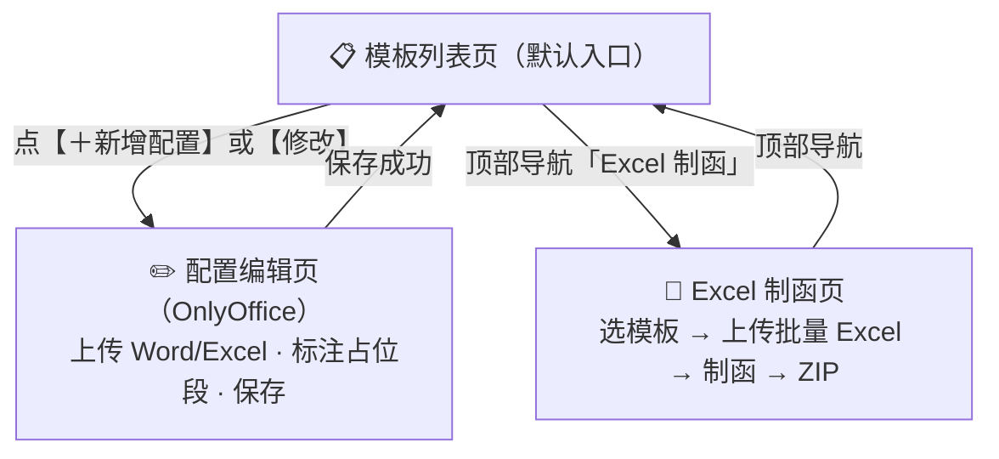
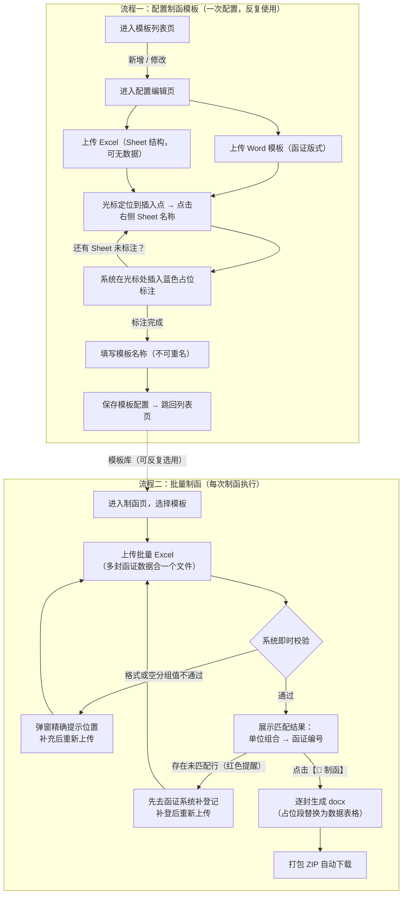
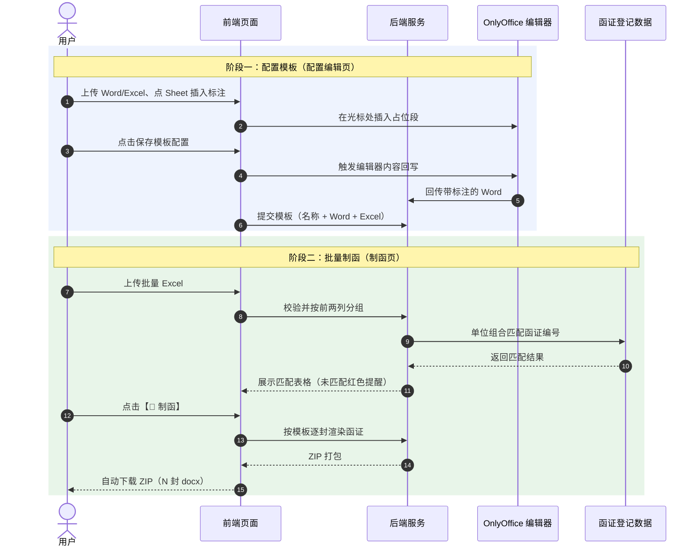
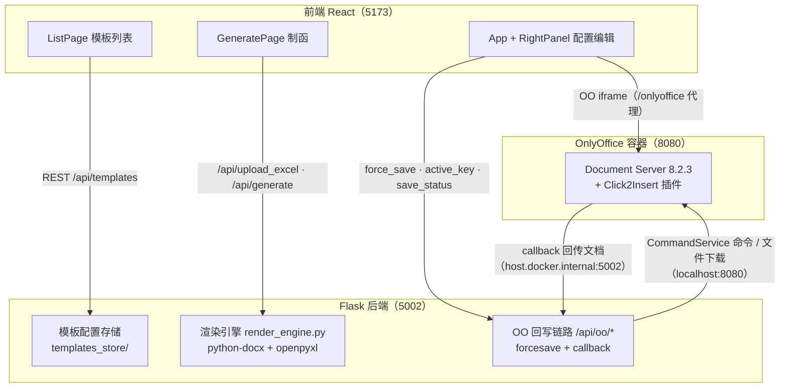
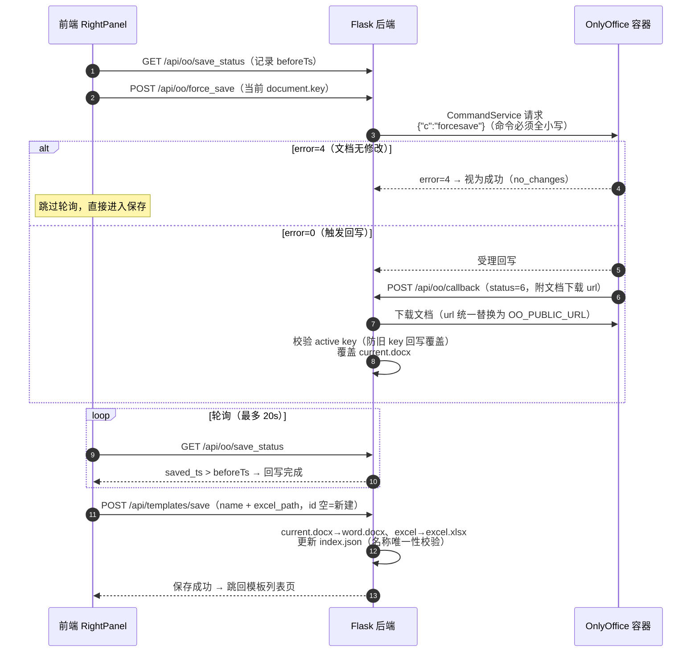
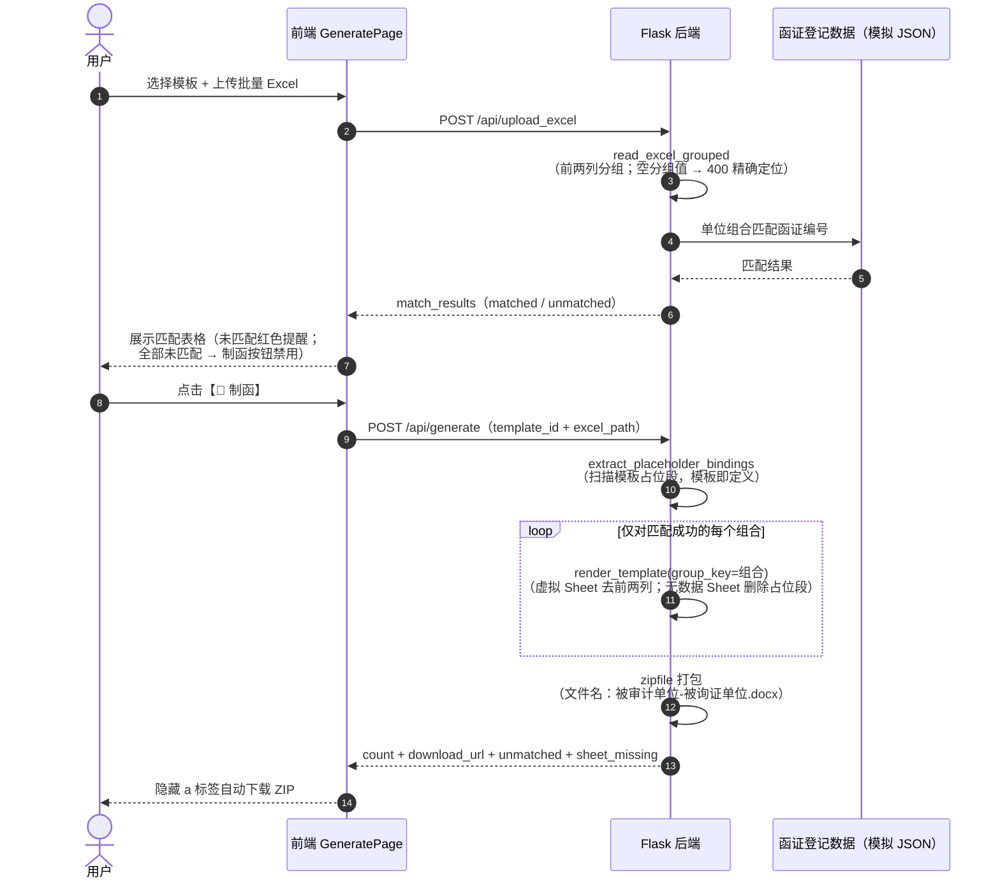

# 函证制函功能需求文档

> 版本：v1.1（2026-09-01）——补充业务框图：新增「4.3 系统整体使用逻辑图」「4.4 系统交互逻辑简览」「8.3/8.4 组件时序图」，第 3 节页面关系图与第 8 节架构/数据流图由 ASCII 统一替换为 mermaid；业务规则与接口内容无变化
> 历史版本：v1.0（2026-08-31）
> 适用范围：函证系统——补充制函功能（往来函证批量制函 + 制函模板配置管理）
> 读者：第一部分面向业务/产品人员；第二部分面向开发人员

---

# 第一部分：业务需求与功能说明

## 1. 背景与定位

审计人员在出具函证时，需要把 Excel 中的往来数据（科目余额、非标事项、票据等）以表格形式填入 Word 格式的函证模板。传统手工方式逐表复制粘贴，效率低、易错位。

本功能是**公司函证系统的一个补充制函模块**，目标是：

1. 用户用 Word 维护函证版式（模板），用 Excel 维护数据，两者解耦；
2. 在模板中"标注"每张表格的插入位置，系统制函时自动把 Excel 数据表格填入标注位置；
3. 支持一份 Excel 中包含**多封函证**的数据，一键批量生成全部函证。

**适用范围**：批量制函仅针对**往来函证**（被审计单位 + 被询证单位模式）；不针对银行函证。

## 2. 核心业务概念

| 概念 | 定义 |
|------|------|
| 制函模板 | 一份 Word 模板（含表格插入位置标注）+ 一份 Excel（定义 Sheet 结构与表头）的组合，有唯一名称 |
| 占位段（标注） | 在 Word 模板中插入的一行蓝色文字：`【Sheet「Sheet名」表格将在此处展示】`，标记"该位置在制函时替换为对应 Sheet 的表格" |
| 被审计单位 | 函证的出具方主体（审计客户） |
| 被询证单位 | 函证的接收方主体（如证券公司、往来客户） |
| 一封函证 | 由 **(被审计单位, 被询证单位)** 组合唯一确定 |
| 批量 Excel | 多封函证数据写在同一个 Excel 中：每个数据 Sheet 的**前两列**为「被审计单位」「被询证单位」 |

## 3. 功能总览

系统共三个页面（顶部导航切换，均为单页应用内路由）：



| 页面 | 入口 | 功能 |
|------|------|------|
| 模板列表页 | 默认首页 | 展示全部模板配置；新增、修改、删除的入口 |
| 配置编辑页 | 列表页点【＋新增配置】或【修改】 | OnlyOffice 在线编辑 Word；上传 Word/Excel；在光标处插入 Sheet 占位段；保存模板配置 |
| Excel 制函页 | 顶部导航「Excel 制函」 | 下拉选择模板 → 上传批量 Excel → 一键制函 → 下载 ZIP |

## 4. 业务流程

### 4.1 配置制函模板（首次使用 / 模板维护）

1. 进入**模板列表页**，点击【＋ 新增配置】；
2. 进入**配置编辑页**：
   - 上传 **Word 模板**（函证版式：抬头、正文、落款等固定内容）；
   - 上传 **Excel**（只需有 Sheet 名称与表头结构，**可以没有数据**——它仅用于告诉系统"这份模板要用到哪些 Sheet"）；
   - 在左侧 OnlyOffice 编辑器中，把**光标点到希望插入表格的位置**，再点击右侧对应的 Sheet 名称，系统即在光标处插入一行蓝色占位标注；
   - 重复上一步，为每个 Sheet 标注插入位置（同一 Sheet 也可在多个位置插入）；
3. 填写**模板名称**（不可与已有模板重名），点击【保存模板配置】；
4. 系统自动把编辑器当前内容（含标注）保存为该模板的 Word 文件，并跳回列表页。

**修改模板**：列表中点某条配置的【修改】，编辑器自动加载该模板已保存的 Word，修改后保存即覆盖该配置。

**删除模板**：列表中点【删除】，二次确认后删除（不可恢复）。

### 4.2 批量制函（核心业务）

1. 进入**制函页**，下拉选择一个制函模板；
2. 上传**批量 Excel**。系统即时校验：
   - 各 Sheet 表头前两列必须为「被审计单位」「被询证单位」，否则拒绝并提示；
   - 若分组列存在空值，**拒绝并精确提示到位置**（如：`科目余额分录 第5行（被审计单位）`），用户补充后重新上传；
   - **函证编号匹配**：系统取 Excel 中的单位组合去匹配函证系统的函证登记数据（被审计单位+被询证单位 → 函证编号），并展示匹配结果表格——匹配成功带出函证编号；未匹配的行**红色提醒"系统没有对应的函证"**；
3. 点击【🚀 制函】：
   - 仅生成**匹配成功**的函证；未匹配的组合**整封跳过**并在结果中明确提示；
   - 若全部组合均未匹配，终止制函并提示先在函证系统完成登记；
   - 对每一封匹配成功的函证：以所选模板为底稿，把各占位段替换为该组合对应的数据表格（**前两列不进入表格**，表格从第 3 列开始）；
   - 每封函证输出一个 Word 文件，文件名为 `被审计单位-被询证单位.docx`；
   - 全部函证打包为一个 **ZIP** 供下载。

**示例**：Excel 中有 2 个被审计单位 × 3 个被询证单位的数据 → 一次生成 6 封函证。

### 4.3 系统整体使用逻辑图

系统使用分两条主线：**模板配置**（一次配置，反复使用）与**批量制函**（每次制函执行）。



### 4.4 系统交互逻辑简览

业务读者视角：保存模板与批量制函两件事背后，用户、前端、后端、OnlyOffice 编辑器与函证登记数据之间各发生了什么。



> 完整的接口级时序（含 forcesave 回写链、渲染引擎内部流程）见第二部分 8.3 / 8.4。

## 5. 业务规则明细

### 5.1 批量 Excel 数据规则

| 规则 | 说明 |
|------|------|
| 分组列 | 每个数据 Sheet 的第 1 行前两列必须为「被审计单位」「被询证单位」（精确匹配） |
| 表头与数据 | 第 1 行为表头，第 2 行起为数据；全空行自动忽略 |
| 前两列的用途 | ① 判定行属于哪封函证；② 作为输出文件名。**制函时前两列不展示**——生成的表格从第 3 列开始（表头同理） |
| 无分组结构的 Sheet | 若某 Sheet 表头前两列不是「被审计单位/被询证单位」，该 Sheet 被跳过，不参与制函 |
| 空分组单元格 | 分组列有空值的行：**终止制函**，提示精确到「哪个 Sheet、Excel 第几行、哪一列为空」；超过 20 处时截断汇总。用户补充后重新上传 |
| 函证编号匹配 | 上传 Excel 后，系统把 (被审计单位, 被询证单位) 组合与**函证系统登记数据**精确匹配（登记数据 = 单位组合 → 函证编号）：匹配成功在制函页表格中带出函证编号；未匹配行红色提醒"系统没有对应的函证"，**制函时整封跳过**；全部未匹配则终止。登记数据现阶段存于 `data/letters_registry.json`（模拟），集成函证系统后替换为真实接口 |
| 数据类型 | 单元格中的日期、数字等自动转为文本展示 |

### 5.2 模板与占位段规则

| 规则 | 说明 |
|------|------|
| 占位段格式 | `【Sheet「Sheet名」表格将在此处展示】`（蓝色加粗文字），由系统插入，也可手工书写（格式一致即可被识别） |
| 模板即定义 | 制函时系统扫描模板中的全部占位段自动确定插入关系，无需额外配置绑定表 |
| 同一 Sheet 多处插入 | 允许；制函时按出现次序依次替换 |
| 无数据 Sheet 的占位段 | 若某 Sheet 在制函 Excel 中无数据，函证中该占位段会被**删除**（不留残留文字） |
| 引用了不存在 Sheet 的占位段 | 该位置不生成表格，制函结果中会提示缺失的 Sheet 清单 |
| 模板名称 | 全局唯一；新增/修改时校验 |
| 表格样式配置（可选） | 模板配置页「表格样式（高级，可选）」折叠区，可配置：字号（数字输入，磅，默认 10，范围 5-72）、字体（默认继承模板）、水平对齐（默认居中）、垂直对齐（默认顶端）、行高（默认自动；可选最小值 XX 磅，内容多自动加高不截断）、列宽三档——**均分（默认）/ 按内容自适应（每列宽度按表头与数据最大字符数自动加权，中文按 2 倍宽计，零配置）/ 自定义比例（按 Sheet 逐个配置，如 `科目余额分录: 2:1:1`；未配置的 Sheet 按均分）**。表头与数据统一配置，表头固定加粗。样式跟随模板存储，不配置则按默认值渲染（与历史行为一致） |

### 5.3 制函输出规则

| 规则 | 说明 |
|------|------|
| 输出数量 | 与 Excel 中的单位组合数一致（N 组合 = N 封） |
| 文件命名 | `被审计单位-被询证单位.docx`（非法文件名字符自动替换为下划线） |
| 打包 | 全部 docx 打成一个 ZIP 下载 |
| 表格样式 | 表头 = Sheet 第 1 行（第 3 列起，加粗）；数据行 = 该组合的全部行；表格带边框（Table Grid），总宽锁定为页面文本宽度；字号/字体/对齐/行高/列宽按模板的表格样式配置渲染（未配置用默认值：10 磅、水平居中、顶端对齐、行高自动、列宽均分） |
| 模板保护 | 制函不修改模板本身——同一模板可反复使用 |

## 6. 页面交互说明

### 6.1 模板列表页（默认首页）

- 卡片式列出全部模板配置：名称、包含的 Sheet 明细与数量、更新时间；
- 每条配置带【✏️ 修改】【🗑 删除】（删除需二次确认）；
- 右上角【＋ 新增模板】大按钮；空状态有引导文案；
- 从编辑页保存成功后自动跳回本页并刷新数据。

### 6.2 配置编辑页

- 顶部：`← 返回模板列表` + 当前模式标识（`✏️ 编辑模板「xxx」` / `📄 新增模板`）；
- 左侧 OnlyOffice 编辑器（中文界面）+ 右侧操作面板（上传 Word / 上传 Excel / Sheet 列表点击插入）；
- **新增模式空白态**：新增模板时编辑器不加载任何历史文档，显示居中占位提示"请先在右侧上传 Word 模板"，上传 Word 后才加载其内容（避免历史残留文档干扰）；编辑模式则自动加载该模板已保存的 Word；
- 底部保存区：模板名称输入 + 【保存模板配置】；保存时系统**自动把编辑器当前内容回写保存**（含占位段标注），用户无需手动导出文件；
- 页面间切换不丢失编辑状态（编辑器实例常驻）。

### 6.3 Excel 制函页

- 三步式布局：①选模板（下拉，含 Sheet 数提示）→ ②上传批量 Excel（即时校验与提示）→ ③【🚀 制函】；
- 上传即校验：非批量格式、空分组行（精确定位）都会即时弹窗拦截；
- 上传成功后展示**匹配结果表格**（被审计单位/被询证单位/函证编号/状态）：未匹配行红色标注，未匹配数大于 0 时提示"制函将跳过"；全部未匹配时制函按钮禁用；
- 生成中按钮锁定防重复点击；完成后 ZIP 自动下载，并提示缺失 Sheet 清单与跳过的未匹配函证数（若有）。

---

# 第二部分：开发实现说明

## 7. 技术栈与运行环境

| 层 | 技术 | 说明 |
|----|------|------|
| 前端 | React 17 + Vite 5 | 自写 hash 路由（零路由依赖）；端口 5173 |
| 在线编辑 | OnlyOffice Document Server 8.2.3 | Docker 容器 `onlyoffice`，宿主机端口 8080；前端经 `/onlyoffice` 代理访问 |
| 后端 | Flask（Python 3.14 venv） | 端口 5002；python-docx（Word 渲染）+ openpyxl（Excel 解析）；标准库 zipfile 打包 |
| 文件存储 | 本地文件系统 | 工作区 `uploads/`、产物 `outputs/`、模板库 `templates_store/` |
| 静态托管 | `http.server` | 端口 8899，托管 conversion_test 目录（历史兼容） |

**网络要点**：OnlyOffice 容器通过 `http://host.docker.internal:5002` 回访宿主机 Flask（拉取模板、回传保存）；Flask 通过 `http://localhost:8080` 访问 OO（CommandService 命令与文件下载）。

## 8. 系统架构与数据流



**批量制函数据流**：


### 8.3 时序图：保存模板配置（OO forcesave 回写链）

对应 10.4 节与 11.4 节接口；关键约束：CommandService 命令名必须全小写 `forcesave`，callback 须校验 active key 防旧文档覆盖。



### 8.4 时序图：批量制函（校验匹配 + 逐封渲染）

对应 11.2 / 11.3 节接口；登记数据现阶段存于 `data/letters_registry.json`（模拟），集成函证系统后替换为真实接口。



## 9. 目录结构

```
04_Letter_Gen/
├── react_app/                        # 前端
│   └── src/
│       ├── main.jsx                  # hash 路由壳：三页常驻挂载（display 切换）+ 顶部导航
│       ├── ListPage.jsx              # 模板列表页（#/templates）
│       ├── App.jsx                   # 配置编辑页（#/config，含 OO 容器）
│       ├── RightPanel.jsx            # 配置页右面板：上传 word/excel、Sheet 插入、保存模板
│       ├── GeneratePage.jsx          # 制函页（#/generate）
│       ├── OnlyOfficeEditor.jsx      # OO 编辑器封装（自管生命周期 + Click2Insert 插件插入）
│       └── styles.css
├── code/render_verify/               # 后端
│   ├── app.py                        # Flask 全部路由
│   ├── render_engine.py              # 渲染引擎（分组/提取绑定/注入表格）
│   ├── templates_store/              # 模板配置库（index.json + tpl_<id>/ 子目录）
│   ├── uploads/                      # 工作区（current.docx、上传的 excel）
│   └── outputs/                      # 制函产物（docx/zip）
└── docs/制函功能需求文档.md
```

## 10. 前端实现要点

### 10.1 路由（main.jsx）

- 自写 hash 路由：监听 `hashchange`，`#/templates`（默认）| `#/config[?id=]` | `#/generate`；
- **三页常驻挂载，仅 display 切换**——OO 编辑器实例永不因切页卸载。若用条件渲染卸载配置页，React 移除容器 div 会与 OO SDK 异步 `destroyEditor` 产生竞态（SDK 内部 `getElementById` 返回 null → `getBoundingClientRect` 报错）；
- 编辑中模板名通过 `?id=` 查询参数 + `GET /api/templates` 反查。

### 10.2 配置编辑页 editingId 同步（App.jsx）

- `editingId`（useState）跟随 `hashchange` 同步：hash 以 `#/config` 开头时解析 `?id=tpl_x`；
- **变化才动作**（`editingRef` 比对）：换新 docKey（`genDocKey()`，时间戳+随机永不复用——OO 按 key 缓存文档，key 复用会命中旧缓存）+ `POST /api/oo/active_key` 预注册（竞态保护）+ `setReady(false)`；OO 容器经 docUrl/docKey 变化自动销毁重建；
- `docUrl`：修改模式 = `/api/templates/<id>/word`；新增模式 = `/api/oo/getTemplate`（current.docx）。

### 10.3 光标处插入占位段（OnlyOfficeEditor + Click2Insert）

- OO 8.x 移除了 7.x 的 `window.insertText`，改用**系统级插件 Click2Insert**（部署在 OO 容器 `sdkjs-plugins/click2insert/`，需手动注册到 `plugin-list-default.json`）；
- 前端递归查找 src 含 `click2insert` 的插件 iframe → 调其 `insertText(text)`；插件内部用 OO API `CreateParagraph + AddText + InsertContent` 在光标处插入；
- 插入文本 = `【Sheet「Sheet名」表格将在此处展示】`（蓝色加粗）。

### 10.4 保存模板配置（RightPanel → 后端）

时序：**前端触发 forcesave → 轮询确认 → 落盘**：

1. `GET /api/oo/save_status` 记录当前 `saved_ts`（beforeTs）；
2. 调 `forceSave()`（内部 `POST /api/oo/force_save` 传当前 document.key）；
3. 轮询 `save_status` 直到 `saved_ts > beforeTs`（最多 20s；OO 返回"无修改"时跳过等待）；
4. `POST /api/templates/save`（id 空=新建）——后端把 current.docx 与 excel 复制到模板目录。

## 11. 后端接口清单

统一约定：错误返回 `{"error": "消息"}`（4xx/500）；成功返回 JSON。

### 11.1 模板配置管理

| 接口 | 方法 | 说明 |
|------|------|------|
| `/api/templates` | GET | 模板清单：`{templates:[{id,name,sheets:[...],created_at,updated_at}]}` |
| `/api/templates/save` | POST | 保存配置。JSON `{id?, name, excel_path}`；id 空=新建。校验：名称非空/唯一(400)、excel 存在(400)。行为：复制 current.docx→`word.docx`、excel→`excel.xlsx`，读 sheets 摘要，更新 index.json |
| `/api/templates/<id>` | DELETE | 删除配置（目录 + 清单条目） |
| `/api/templates/<id>/word` | GET | 模板 word 文件（`Cache-Control: no-store`；配置页修改模式供 OO 加载） |

### 11.2 文件上传与批量校验

| 接口 | 方法 | 说明 |
|------|------|------|
| `/api/upload_template` | POST(multipart file) | 上传 Word → 保存副本并覆盖工作区 `current.docx` |
| `/api/upload_excel` | POST(multipart file) | 解析 Excel：返回 `{path, sheets:[{name,header,row_count,preview,is_grouped}], batch_mode, groups, match_results}`。match_results：groups 与函证登记数据匹配的结果 `[{audit, confirm, letter_no, matched}]`。**校验拦截**：分组 Sheet 前两列有空值 → 400，error 内含精确位置清单（`_format_empty_cells`：`Sheet名 第N行（列名）`，超 20 处截断汇总） |
| `/api/letters` | GET | 函证登记清单（`[{audit, confirm, letter_no}]`）。现阶段读 `data/letters_registry.json` 模拟；集成函证系统后替换为真实接口 |

### 11.3 制函

| 接口 | 方法 | 说明 |
|------|------|------|
| `/api/generate` | POST(JSON `{template_id, excel_path}`) | **制函页主接口**。校验：模板存在、批量格式（无分组 Sheet→400"请上传批量格式"）、空分组行(400 定位)、**函证编号匹配（全部未匹配→400"均未登记"）**。流程：`extract_placeholder_bindings(模板)` 提取绑定 → **仅对 matched 组合**循环 `render_template(group_key=组合)`（unmatched 整封跳过）→ ZIP（`_safe_filename` 清洗文件名）→ `{count, files:[{file,audit,confirm,letter_no,tables,...}], unmatched, sheet_missing, download_url}` |
| `/api/render_batch` | POST(JSON `{tpl_path?, excel_path, bindings}`) | 批量渲染（旧入口，bindings 由前端传入；保留兼容） |
| `/api/render` | POST(JSON `{tpl_path?, excel_path, bindings}`) | 单函证渲染（保留兼容） |
| `/api/download/<fname>` | GET | 下载 outputs 产物（按扩展名给下载名） |

### 11.4 OnlyOffice 回写链路（配置页保存依赖）

| 接口 | 方法 | 说明 |
|------|------|------|
| `/api/oo/getTemplate` | GET | OO 服务器拉取工作区 current.docx（no-store） |
| `/api/oo/force_save` | POST(JSON `{key}`) | 向 OO CommandService `POST /coauthoring/CommandService.ashx?shardkey=<key>`，body `{"c":"forcesave","key":key}`——**命令名必须全小写**（`forceSave` 返回 error=5 命令不正确）。OO 响应 error=4（无修改）视为成功并标记 `no_changes` |
| `/api/oo/callback` | POST | OO 回调（status=1 登记 active key；status=2/4/6/7 校验 active key 后从 url 下载文档覆盖 current.docx；旧 key 回写跳过）。url 中容器地址 `127.0.0.1:8000/8080` 统一替换为 `OO_PUBLIC_URL` |
| `/api/oo/save_status` | GET | `{saved_key, saved_ts}` 供前端轮询判断回写完成 |
| `/api/oo/active_key` | POST(JSON `{key}`) | 登记当前活跃编辑器 key（上传模板时前端预注册 + 编辑器创建时注册 + callback status=1 兜底） |

### 11.5 保留兼容接口

- `POST /api/bind_annotate`、`GET /api/template_anchors`：早期锚点预览/绑定回写（当前主流程不依赖）。

## 12. 渲染引擎核心逻辑（render_engine.py）

### 12.1 Excel 读取与分组

```
read_excel_sheets(xlsx)
  → [{name, header, rows, row_nums}]      # row_nums=数据行真实 Excel 行号（报错定位用）
read_excel_grouped(xlsx)
  → {sheets, groups, empty_cells, virtual_sheets}
```

- **分组判定**：表头前两列 strip 后精确等于「被审计单位」「被询证单位」；
- **virtual_sheets**：为每个分组 Sheet × 每个全局组合预构造虚拟 sheet——`header/rows` 均去掉前两列（从第 3 列起）；组合在该 Sheet 无行时 `rows=[]`（渲染时跳过注入并删除占位段）；
- **empty_cells**：前两列任一为空的数据行定位列表 `[{sheet, row, col}]`。

### 12.2 绑定自动提取（模板即定义）

`extract_placeholder_bindings(docx_path)`：正则扫描 `Sheet「(.+?)」` 占位段（按文档顺序）→ `[{sheet_name, pos_index, anchor_mode:'after_para', pos_label}]`。同一 Sheet 多处插入生成多条 binding。

### 12.3 渲染（render_template）

```
render_template(tpl_path, xlsx_path, bindings, out_path, group_key=None)
```

1. `Document(tpl)` 读模板（**不改模板文件**，天然可循环复用）；
2. `group_key` 非空时：sheet_map 用该组合的虚拟 sheet 替换（非分组 Sheet 不在 map → binding 走 not_found）；
3. 逐 binding（**占位段优先，不预建锚点**）：
   - 无数据行 → 记 `skipped_empty` 并**删除占位段**（按出现次序）；
   - `_find_placeholder_para(doc, sheet_name, occurrence)` 找第 N 次出现的占位段 → `inject_sheet_table` 注入表格于占位段后 → 删除占位段；`occurrence_count` 保证同一 Sheet 多处插入依次替换；**此路径不触碰锚点**；
   - 无占位段 → 旧流程 fallback：按 binding 的 `pos_index` 走 `resolve_anchor_idx`（内部按需 `ensure_anchor_count` 补建锚点）在锚点后插入；无 `pos_index` 则文档末尾插入；
   - > 为什么不预建锚点：渲染前预建会使未被使用的锚点段落残留在文档末尾（「（此处将动态插入 Sheet 表格）」×N）——已修复为按需补建；
4. 保存 out_path，返回 stats（injected/skipped_empty/not_found/output_table_count）。

表格样式：`Table Grid` 边框；表头加粗 10pt 居中；列宽均分（twips 精确设置），总宽 = 页面文本宽度。

## 13. 关键技术约束与已知坑（开发必读）

| # | 约束/坑 | 说明 |
|---|---------|------|
| 1 | **OO document.key 必须全局唯一** | OO 按 key 缓存文档，同 key 不重新下载源文件（曾致"上传新模板加载旧文档"）。用 `genDocKey()` 时间戳+随机 |
| 2 | **三页常驻挂载** | 条件渲染卸载配置页会引发 OO SDK 卸载竞态（getBoundingClientRect null）。切页只 display 切换 |
| 3 | **CommandService 命令全小写** | `{"c":"forcesave"}`；`forceSave` 返回 error=5。错误码：0 成功/1 key 不存在/2 callback 不正确/3 内部错误/**4 无修改可保存**（视为成功）/5 命令不正确/6 token 无效 |
| 4 | **OO callback 的下载 url 是容器地址** | host 不固定（127.0.0.1:8000/8080 都出现），须 replace 为 `OO_PUBLIC_URL`（宿主机映射地址） |
| 5 | **Windows GBK 控制台 print 禁用 emoji** | Flask stdout 重定向后为 GBK，print ⏭✅❌ 会 UnicodeEncodeError → 接口 500。已内置 `sys.stdout.reconfigure(utf-8)` 兜底，新增日志请用 ASCII 标记 |
| 6 | **host.docker.internal 双向** | OO→Flask 用 `host.docker.internal:5002`；Flask→OO 用 `localhost:8080` |
| 7 | **切换编辑对象须预注册 active key** | 旧编辑器销毁时 OO 对旧 key 延迟 forcesave，若 active key 未提前切换，旧文档会覆盖新内容 |
| 8 | **中文路径命令行乱码** | cmd/PowerShell 直传中文路径会 GBK 损坏，测试脚本用 ASCII 目录 + os.listdir 定位 |

## 14. 环境与启动

```bash
# 服务（四件套）
# 1) Flask 5002（必须用项目 venv）
venv\Scripts\python.exe code\render_verify\app.py     # 日志: 项目根 flask_out.log / flask_err.log
# 2) 静态托管 8899
venv\Scripts\python.exe -m http.server 8899 --directory code\conversion_test
# 3) 前端 5173
cd react_app && npm run dev
# 4) OnlyOffice docker 8080（镜像 onlyoffice/documentserver:8.2-ready，含 CORS + click2insert 插件）
docker start onlyoffice
```

一键脚本：`start_server.bat`（已同步 venv 路径）；停止：`停止制函验证服务.bat`。

## 15. 集成到函证系统的迁移指引（规划）

| 现状 | 集成时替换为 |
|------|--------------|
| 模板配置存本地 `templates_store/`（index.json 清单） | 函证系统数据库/接口：表结构建议 `id, name, word_file, excel_file, sheets, created_at, updated_at`，文件存对象存储 |
| 前端独立页面 | 以 iframe/微前端嵌入函证系统，或按第二部分接口契约重写 UI |
| `POST /api/generate` 本地文件 | 入参改 `template_id + excel 上传`，产物对接函证系统归档（函数证 id = 被审计单位+被询证单位+批次） |
| OO forcesave 回写 current.docx 单工作区 | 每模板独立工作区（按 template_id 区分 callback 上下文） |

---

## 附：验收检查清单

- [ ] 上传新 Word 模板后 OO 显示新模板内容（唯一 key 生效）
- [ ] 配置页点 Sheet，占位段插入在光标处（中文 OO 界面）
- [ ] 保存模板配置 → 列表出现 → 制函页下拉可见
- [ ] 修改模板：列表点修改 → OO 加载已保存内容 → 保存覆盖
- [ ] 删除模板：confirm 后从列表与目录移除
- [ ] 批量 Excel：6 组合 → 6 封 ZIP，文件名与表格分组正确，前两列不出现在表格
- [ ] 无分组列 Sheet 被跳过；空分组行被终止并精确定位
- [ ] 模板占位段引用的 Sheet 缺失时，制函结果有缺失提示
