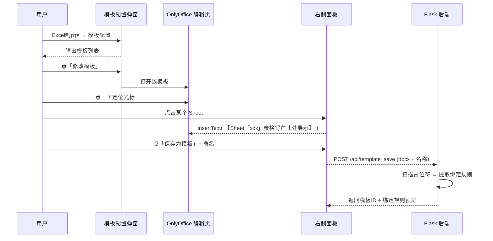
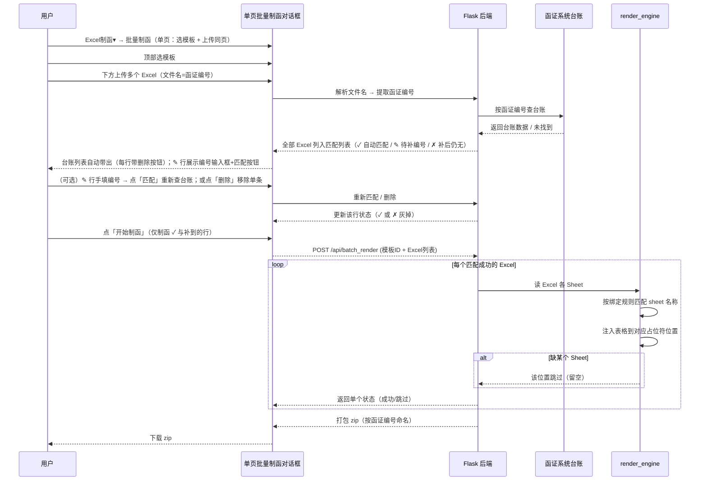

# 制函功能需求说明（04_Letter_Gen）

> **文档类型**：需求说明文档（唯一权威，替代 docs 下其余旧文档）
> **文档版本**：v1.6
> **最后更新**：2026-08-25
> **适用范围**：西点函证系统 · 制函功能（本仓库 `04_Letter_Gen` 为独立验证实现，前端 React + 后端 Flask + python-docx）

---

## 一、背景与目标

### 1.1 背景

西点函证系统原有制函功能以「**数据导入（按科目）→ 模板 `Output()` 函数取数 → 生成 PDF**」为核心模式。该模式存在两个核心痛点：

| # | 痛点 | 本质 |
|----|----|----|
| 1 | **模板调整交互过于复杂**：需进入 OnlyOffice 编辑 Word 模板，接触 `Output()` 函数、`{{变量}}` 等类代码语法，无经验用户学习成本高 | 制函模板调整需"去代码化"，降低门槛 |
| 2 | **科目数据映射方式不灵活**：函面上某张表格有几列、表头是什么、放哪些数据，用户无法随心所欲地定义 | 希望"表格即数据"直填：用户自己在 Excel 里维护表格内容，系统只负责排版 |

### 1.2 目标

在**不破坏现有 `Output()` / `{{变量}}` 模式**的前提下，新增一种更友好的制函方式：**用户配置模板 + 批量上传 Excel 自动制函**，让无经验用户也能快速、灵活、批量地完成制函。

### 1.3 已确认的核心决策

| # | 决策点 | 结论 |
|----|----|----|
| 1 | 批量粒度 | **1 个 Excel = 1 份函证** |
| 2 | 模板占位符 | `【Sheet「xxx」表格将在此处展示】`（与 OnlyOffice 上用户看到的标记一致，不搞两套语法） |
| 3 | 占位符生成方式 | **首选自动带出**（右侧点 Sheet → 左侧 OnlyOffice 光标处自动写入）；手写兜底（内容一目了然） |
| 4 | Sheet 匹配 | 按 **Sheet 名称固定匹配**（模板配置时的名称 = 批量 Excel 的名称） |
| 5 | 模板组成 | Word（含占位符）+ 绑定规则（自动从占位符扫描提取） |
| 6 | 模板存储 | `data/templates/` 目录 = 模板 docx + `templates.json` 清单（含绑定规则） |
| 7 | 缺 Sheet 处理 | **跳过该 Sheet**（函证该位置留空，不报错不中断） |
| 8 | 生成文件命名 | 用 **函证编号**（从 Excel 文件名解析）；重名自动加序号 `(1)` |
| 9 | 结果交付 | 批量生成后**打包 zip 下载**，不做浏览器逐份预览 |
| 10 | `{{变量}}` | **本项目不处理**（保留现状；参考 HanZheng 项目 poi-tl 原理但不修改） |
| 11 | 制函模式 | **统一为模板化制函**（配置模板 + 上传 Excel 制函）。**不保留独立的"单份手动绑定"制函路线**——单份 = 批量上传 1 个 Excel 的特例，由同一套流程覆盖 |
| 12 | Excel 文件名规则 | 文件名 = **函证编号**（可带描述）：`wlfz002001.xlsx` 或 `wlfz002001_中信证券.xlsx`；系统取**第一个 `_` 前部分**作为函证编号去台账匹配 |
| 13 | 台账匹配 | 系统从文件名提取函证编号 → **查函证系统台账**；**所有上传的 Excel 均列入台账匹配列表**（不立刻丢弃）。匹配结果分三态：✓ 自动匹配（文件名解析出的编号在台账中）、✎ 待补编号（解析失败/台账暂无，带"函证编号"输入框，用户填后重新匹配一次）、✗ 补后仍无（填了仍不在台账）。✓ 与 ✎ 补到的可制函；未匹配项灰掉不可制函。每条均带「删除」按钮（传错/不想要可移除单条，无需整体重传） |
| 14 | UI 配色 | 与函证系统一致，主色 **`#6083F0`** |
| 15 | 入口集成方式 | 原"PDF格式制函 / 修改制函模板"两个按钮合并为下拉 `标准科目函证制函▾`；新增下拉 `Excel制函▾`（含 批量制函 / 模板配置），**放老按钮前面**；两个按钮样式一致，新按钮不做特殊突出 |
| 16 | 模板名称唯一 | **模板名称全局唯一**：上传 Word 模板（`/api/upload_template_oo`）或保存模板（`/api/template_save`）时，若名称与已有模板重复，后端返回 409 拒绝；**修改模板并保留原名**属于"更新"场景，自动覆盖旧条目，不受唯一性限制 |
| 17 | 模板唯一标识 | 每个模板在后端 `templates.json` 中以 `id`（8 位 uuid 短码）唯一标识；名称仅作展示，去重/更新以 id 为准 |
| 18 | 新建模板空画布 | 从`+ 新建模板`进入 OnlyOffice 编辑页时，**左侧不预加载任何 Word 模板**（不加载 default 模板）；页面显示占位提示"暂无 Word 模板，请上传后加载"。用户点击「上传 Word 模板」成功后，左侧 OnlyOffice 才加载该 docx |
| 19 | 编辑页展示方式 | **模板编辑页（修改/新建）以整个页面展示，不做弹窗**：顶部为工具栏（标题 + 返回按钮），中部左侧 OnlyOffice、右侧配置面板，底部状态栏，占满整个视口 |

---

## 二、整体制函流程总览

### 2.1 用户视角的单一主线

> 制函统一为一条主线：**配置模板 + 上传 Excel 制函**。单份 = 上传 1 个 Excel 的特例，不设独立的"手动绑定"路线。

### 2.2 入口集成（函证管理页）

在函证管理页原有按钮区，调整为（新在前、老在后，样式一致）：

```
[批量上传原始函证] [Excel制函 ▾] [标准科目函证制函 ▾] [批量合并下载] [数据修改日志]
   ↓                      ↓
批量制函（单页）       PDF格式制函（老）
模板配置（列表弹窗）      修改制函模板（老）
```

- **Excel制函 ▾**（新制函方式，按钮放在老制函前面）：菜单 = `批量制函` / `模板配置`
- **标准科目函证制函 ▾**（老制函两个按钮合并改名）：菜单 = `PDF格式制函` / `修改制函模板`
- 两个下拉按钮样式完全一致，新按钮不做特殊高亮/角标。

### 2.3 技术架构

```mermaid
flowchart LR
    subgraph 前端 react_app (Vite :5173)
        FE1[OnlyOffice 编辑器<br/>模板编辑/占位符定位]
        FE2[右侧面板<br/>上传Excel/点Sheet/批量制函]
    end

    subgraph 后端 Flask (:5002)
        BE1[/api/upload_excel<br/>解析多Sheet]
        BE2[/api/template_save<br/>保存模板+扫描绑定规则]
        BE3[/api/templates<br/>模板列表]
        BE4[/api/batch_render<br/>批量制函打包zip<br/>（1 个 Excel 即单份）]
        BE5[render_engine.py<br/>inject_sheet_table 注入表格]
    end

    subgraph 数据/依赖
        D1[data/templates/<br/>模板docx + templates.json]
        D2[OnlyOffice 容器 :8080]
        D3[函证系统台账<br/>按函证编号查数据]
    end

    FE1 --> D2
    FE2 --> BE1 & BE2 & BE3 & BE4
    BE1 & BE2 & BE3 & BE4 --> BE5
    BE2 --> D1
    BE3 --> D1
    BE4 --> D1
    BE4 --> D3
```

---

## 三、核心概念与数据模型

### 3.1 术语

| 术语 | 说明 |
|----|----|
| **函证** | 一份被询证单位的询证函，= 一份 Word 输出 |
| **模板** | Word（含占位符）+ 绑定规则（Sheet名 → 位置），配置一次批量复用 |
| **占位符** | 模板中标记"这里放哪个 Sheet 表格"的文本：`【Sheet「xxx」表格将在此处展示】` |
| **绑定规则** | 从占位符自动提取的映射：`{sheet名称 → 文档位置}` |
| **Sheet** | Excel 中的一张表（表头第一行 + 数据行），对应函面上的一张表格 |
| **批量制函** | 选模板 + 多 Excel → 按规则逐份生成函证 |
| **函证编号** | 函证系统在台账中的唯一编号（如 `wlfz002001`）；Excel 文件名以其命名，用于匹配台账 |

### 3.2 模板数据模型

```
data/templates/
  <模板名>.docx          # 配置好的 Word（含占位符）
  templates.json          # 清单：
                          # [{ "id", "name", "docx", "bindings": [
                          #     {"sheet_name": "销售与未结算", "placeholder": "【Sheet「销售与未结算」表格将在此处展示】", "para_index": 12},
                          #     {"sheet_name": "其他往来款",   "placeholder": "...", "para_index": 20}
                          #   ]}]
```

**关键点**：绑定规则**不是单独配置**，而是保存模板时**扫描 Word 里的占位符自动提取**。用户"配置模板" = 在 OnlyOffice 里把占位符放好即可。

### 3.3 Excel 数据模型（每个函证一份 Excel）

| 层 | 内容 |
|----|----|
| Excel 文件名 | **函证编号**（可带描述）：`wlfz002001.xlsx` 或 `wlfz002001_中信证券.xlsx`；系统取首个 `_` 前段作函证编号 |
| Excel 内 Sheet | 函面上的一张表格：**第一行=表头**，其余=数据行；列数/表头/数据全部用户定义 |
| 台账匹配 | 从文件名解析出函证编号 → 查函证系统台账 → 取该函证的数据（与 Sheet 名匹配注入） |

---

## 四、配置模板流程（一次性，低频）

### 4.1 入口

`Excel制函 ▾` → `模板配置` → **弹出「模板配置」弹窗**（非独立页面，无左侧导航）。

### 4.2 模板配置列表弹窗

- 展示所有模板：模板名（带版本号）+ 绑定 Sheet 标签 + 更新时间 + 操作（`修改模板` / `删除`）
- 右上 `+ 新建模板` 按钮
- 点「**修改模板**」→ 进入 OnlyOffice 编辑页（见 4.3）
- 点「**+ 新建模板**」→ 进入 OnlyOffice 编辑页（见 4.5），左侧为空画布，需先上传 Word

### 4.3 修改模板配置界面（OnlyOffice，整页展示）

**展示方式**：点「修改模板」后，**以整个页面展示编辑界面，不再弹窗**。顶部为工具栏（标题 + 返回按钮），中部左侧 OnlyOffice、右侧配置面板，底部状态栏，占满整个视口。

**保存逻辑（关键）**：修改模板时，右侧只显示「保存当前模板」按钮，**不再出现模板名称输入框**，直接保存到当前模板名称下，覆盖更新原模板。不会因为用户填写了新名称而新建另一条模板记录。

1. 在 OnlyOffice 打开该 Word 模板（**只展示当前模板，不做模板切换**）
2. （可选）右侧「加载参考 Excel」→ 显示其 Sheet 列表，作为 sheet 名来源
3. 在左侧模板中点一下定位光标 → 右侧点某个 Sheet → 自动写入：
   `【Sheet「销售与未结算」表格将在此处展示】`
4. 重复步骤 3，把所有要放表格的位置都标好（可在不同位置放不同 Sheet）
5. 右侧点「保存」→ 系统扫描占位符提取绑定规则 → 更新到当前模板

### 4.4 关键规则

- **参考 Excel 可选**：不加载参考 Excel 时，用户手动写占位符文本也行（内容固定格式，一目了然）。
- **保存即解析**：保存时后端扫描 `【Sheet「xxx」表格将在此处展示】`，记录每个占位符的 sheet 名 + 文档位置，存 `templates.json`。
- **可再次编辑**：模板列表里可重新打开已有模板，调整占位符后再保存（覆盖更新绑定规则）。
- **占位符数量不限**：一个模板可绑定多个 Sheet、一个 Sheet 也可放多个位置。
- **编辑页不切换模板**：进入 OnlyOffice 后只展示当前模板，不提供模板切换入口，避免误切换导致内容错乱。
- **模板名称全局唯一**：上传/保存时名称与已有模板重复会被后端拒绝（返回 409 并提示）；修改模板保留原名属"更新"场景，自动覆盖旧条目。

### 4.5 新建模板配置界面（OnlyOffice，空画布，整页展示）

**展示方式**：点「+ 新建模板」后，**以整个页面展示编辑界面，不再弹窗**，顶部工具栏（标题 + 返回按钮），中部左侧 OnlyOffice、右侧配置面板，底部状态栏。

**操作顺序（与提示词一致）**：

- **上传 Word 模板**（无步骤号）：位于右侧最上方
  1. 进入编辑页时，**左侧 OnlyOffice 不预加载任何 Word 模板**，显示占位提示："暂无 Word 模板 / 请使用右侧「上传 Word 模板」按钮加载文档"
  2. 点「**上传 Word 模板**」→ 选择本地 `.docx` → 后端保存（`/api/upload_template_oo`）→ 左侧 OnlyOffice 加载该 docx
     - 若文件名（去后缀）与已有模板重名，后端返回 409，前端提示"模板名称重复"且不加载
- **1.（可选）加载参考 Excel**：上传 Word 成功后，选择参考 Excel 查看 Sheet 列表
- **2. 保存为模板**：输入新模板名称 → 点「保存为模板」→ 后端扫描占位符提取绑定规则 → 存到 `data/templates/`
  - 若名称与已有模板重复，后端返回 409 拒绝
  - 保存成功后自动刷新模板列表

### 4.5 配置模板流程图



---

## 五、批量制函流程（每次，高频）

### 5.1 入口与单页批量制函

`Excel制函 ▾` → `批量制函` → 弹出**单页批量制函对话框**（选模板 + 上传Excel+匹配台账**同页展示，省一次点击**，不再分两步向导）：

**页面布局（上下分区，同页）**

- 顶部：函证模板下拉（与 PDF 制函第一步一致）
- 下方：上传 Excel + 匹配台账区（见下）
- 不切换页面

**上传 Excel + 匹配台账**

```
上传多个 .xlsx（文件名 = 函证编号，可带描述）
  例：wlfz002001.xlsx  或  wlfz002001_中信证券.xlsx

系统解析文件名 → 提取函证编号 → 查函证台账
  所有 Excel 均列入台账匹配列表（不立刻丢弃）

匹配结果三态：
├─ ✓ 自动匹配  ：文件名解析出的函证编号在台账中 → 直接显示台账信息，可制函
├─ ✎ 待补编号  ：解析失败 / 台账暂无 → 该行显示「函证编号」输入框，用户手填后重新匹配一次
│               └─ 填后匹配成功 → 升级为 ✓ 自动匹配，可制函
│               └─ 填后仍未匹配 → 升级为 ✗ 补后仍无，灰掉不可制函
└─ ✗ 补后仍无  ：用户已填但台账仍无此编号 → 灰掉，不可制函
```

- 上传区支持拖拽/多选
- **匹配汇总条**：共上传 N 个 / ✓ 已匹配 M / ✎ 待补 K / ✗ 无匹配 J
- **台账列表自动带出**：上传后自动显示全部 Excel（文件→函证编号→客户名称→被询证单位→联系人→匹配状态）。每行带「删除」按钮（传错/不想要可移除单条，无需整体重传）。
- **✎ 待补编号行交互**：展示「函证编号」输入框 + 「匹配」按钮；用户输入编号点匹配 → 系统查台账，成功则升级为 ✓，失败则升级为 ✗。
- **开始制函范围**：仅对 ✓ 自动匹配 与 ✎ 补到并匹配上的 Excel 制函；✗ 无匹配项灰掉、不可选、不计入制函数量。
- **匹配失败提示**：⚠️ 若有 ✗ 无匹配项，列表顶部提示"N 个未匹配，已置灰不参与制函，可手动补编号或删除"；不再用阻断式弹窗。
- 底部「🚀 开始制函（M）」→ 对可制函的 Excel 逐个渲染 → 按函证编号命名 → 打包 zip（M = 可制函数量）

### 5.2 用户操作步骤（文字版）

```
1. Excel制函▾ → 批量制函 → 弹出单页对话框（选模板 + 上传Excel 同页）
2. 顶部选模板
3. 下方上传 Excel（文件名 = 函证编号，可带描述），系统自动匹配函证台账，全部 Excel 列入列表；✓ 直接可制函，✎ 待补编号，✗ 无匹配
4. （可选）对 ✎ 行手填函证编号点「匹配」救回；或对传错/不想要的行点「删除」
5. 点「开始制函」（仅制函 ✓ 与补到的行；✗ 灰掉不计入）
6. 系统逐个处理（读 Excel Sheet → 按模板绑定规则匹配 → 注入表格 → 缺 Sheet 留空跳过）
7. 按函证编号命名生成 docx → 打包 zip 下载
```

### 5.3 生成规则

| 规则 | 说明 |
|----|----|
| 输出文件 | 每个 Excel → 一份 docx，用 **函证编号**命名（`wlfz002001.xlsx` → `wlfz002001.docx`） |
| 重名处理 | zip 内自动加序号：`wlfz002001.docx`、`wlfz002001(1).docx` |
| 表格注入 | 复用现有 `inject_sheet_table`：列数=Sheet列数、表头=第一行、总宽锁定模板文本宽度 |
| 缺 Sheet | 跳过该位置（留空），不影响其他绑定渲染，不中断整批 |
| 匹配失败 | 不丢弃：列入台账列表为 ✎ 待补编号，用户可手填函证编号重新匹配救回，或点「删除」移除；填后仍无匹配 → ✗ 灰掉不制函 |
| 交付 | 全部生成后打包 zip 下载 |

### 5.4 批量制函流程图



---

## 六、当前已实现能力（基线，将被新流程复用/改造）

> 以下为 `04_Letter_Gen` 已验证跑通的部分。**不保留独立的"单份手动绑定"制函路线**（已并入模板化制函），但其中可复用的能力继续使用。

### 6.1 可复用的已实现能力 ✅

| 能力 | 说明 | 在新流程中的用途 |
|----|----|----|
| Excel 多 Sheet 解析 | 上传 Excel → 解析各 Sheet（表头=第一行 + 数据行） | 配置模板时"加载参考 Excel"；制函时读取每个 Excel |
| 点 Sheet 写入占位符 | 通过 `insertText` 在 OnlyOffice 光标处写入 `【Sheet「xxx」表格将在此处展示】` | 配置模板时自动带出占位符 |
| `inject_sheet_table` | 按 Sheet 动态生成表格（列数=Sheet列数、表头=第一行、总宽锁定文本宽） | 制函时注入表格到占位符位置 |
| OnlyOffice 编辑 | 模板在线编辑（光标定位、插入文本） | 配置模板的定位/写占位符 |

### 6.2 服务架构（已实现 ✅）

| 服务 | 端口 | 用途 |
|----|----|----|
| react_app (Vite) | 5173 | 前端界面 |
| Flask | 5002 | 后端 API + 静态 docx |
| OnlyOffice 容器 | 8080 | 模板在线编辑 |

---

## 七、待实现范围（本次需求）

### 7.1 后端（render_engine.py + app.py）

| 功能 | 说明 |
|----|----|
| `extract_placeholders(doc)` | 扫描 Word 中 `【Sheet「xxx」表格将在此处展示】`，提取 `{sheet_name, para_index}` 绑定规则 |
| `render_by_template(tpl_path, xlsx_path, placeholders)` | 按绑定规则，在每个占位符位置注入对应 Sheet 表格（复用 `inject_sheet_table`） |
| `POST /api/template_save` | 上传 Word → 扫描占位符 → 存 `data/templates/`（docx + templates.json） |
| `GET /api/templates` | 列出已配置模板及绑定规则 |
| `POST /api/template_delete` | 按 id 删模板+文件 |
| `GET /api/oo/template/<tid>` | 返回已存模板 docx 供 OnlyOffice 加载（`tid='default'` 返回 demo 默认模板，仅兼容） |
| `POST /api/upload_template_oo` | 上传用户 Word 模板 → 存 `data/templates/`，名称全局唯一（重复返回 409） |
| `POST /api/batch_render` | 选模板 + 1 个或多个 Excel → 逐个渲染 → 打包 zip（按函证编号命名） |
| **台账匹配接口**（对接函证系统） | 接收函证编号 → 查函证系统台账 → 返回该函证数据；验证项目阶段用 **mock 台账** 模拟（后续替换为真实接口） |

### 7.2 前端（react_app）

| 功能 | 说明 |
|----|----|
| 入口集成 | 函证管理页新增 `Excel制函▾`（批量制函 / 模板配置，放前）+ `标准科目函证制函▾`（老，放后），主色 `#6083F0` |
| 模板配置弹窗 | 从 `Excel制函▾ → 模板配置` 弹出列表弹窗（非独立页面）；含新建/修改/删除 |
| 修改模板编辑页 | 点「修改模板」进入 OnlyOffice 编辑页（只展示当前模板，不切换）；点「+ 新建模板」进入空画布编辑页，需先上传 Word 后才加载 |
| 模板名称唯一与 id 标识 | 上传/保存模板校验名称全局唯一（重复 409）；每个模板以 `id` 唯一标识，模板配置列表支持删除 |
| 批量制函单页对话框 | 选模板 + 上传Excel+匹配台账**同页**（省去两步向导切换）；下方上传 Excel 自动匹配（全部列入列表，✓ 自动匹配 / ✎ 待补编号含输入框可重匹配 / ✗ 灰掉）；每行可「删除」单条；开始制函仅制函 ✓ 与补到的行 → zip 下载 |
| 旧单份手动绑定界面 | **移除**（并入模板化制函流程，不单独保留） |

---

## 八、边界与异常处理

| 场景 | 处理策略 |
|----|----|
| Excel 文件名非函证编号格式 / 不在台账 | 列入台账列表为 **✎ 待补编号**（不丢弃、不弹窗阻断）；用户可手填函证编号点「匹配」重新查台账救回，或点「删除」移除单条；填后仍无匹配 → **✗ 灰掉不制函** |
| 批量 Excel 缺模板要求的某个 Sheet | **跳过该 Sheet**（该位置留空），不中断整批 |
| Excel 文件损坏/无法解析 | 该 Excel 报错，不影响其他 Excel |
| 模板未配置绑定规则 | 提示"请先在模板中放入占位符" |
| 同名函证编号 | zip 内自动加序号 `(1)` |
| 模板占位符手写错误（sheet 名不在 Excel 中） | 该位置留空，跳过 |
| 新建模板未上传 Word 即点"保存为模板" | 提示"请先上传 Word 模板"；左侧为空画布不加载 default 模板 |
| **上传/保存模板名称重复** | 后端返回 **409**，前端弹"模板名称重复"提示，不覆盖其他模板；仅"修改模板保留原名"属正常更新 |

---

## 九、原型图（最终确认版）

> 目录 `docs/proto/`，主色 `#6083F0`。原型图改为 HTML 格式，浏览器直接打开即可查看。

| HTML 原型 | 对应界面 |
|------|---------|
| `集成方案3_定稿.html` | 入口集成定稿（Excel制函▾ + 标准科目函证制函▾） |
| `模板配置列表弹窗.html` | 模板配置 · 列表弹窗（从「Excel制函▾→模板配置」弹出） |
| `模板编辑页.html` | 修改模板配置界面（OnlyOffice，单模板不切换） |
| `batch_wizard_step2_demo.html` | Excel制函 · 单页批量制函（选模板 + 上传匹配同页） |

---

## 十、参考实现（HanZheng `{{变量}}` 原理，仅参考不改）

- 引擎：Java 后端 **poi-tl**（`XWPFTemplate.compile(tpl).render(hashMap)`）在制函时替换 `{{变量}}`。
- 取值：变量值来自**数据库**（`IB_CONFIRM_REL_DATA` 关联数据 + `IB_CONFIRM_SUBJECT_DATA` 科目数据 + 函证表单位信息），组装成 `mainJson`/`noMainJson` 并入渲染 map。
- 命名规则：`{{类型编码_字段编码}}`，如 `jcxx` = 基础信息主表类型编码、`UNIT_CODE` = 单位编码字段 → `{{jcxx_UNIT_CODE}}` 的值 = 被询证单位名称。
- 本项目不修改/不实现 `{{变量}}`，保留现状。

---

## 十一、变更记录

| 日期 | 类型 | 变更内容 | 影响范围 | 状态 |
|----|----|----|----|----|
| 2026-08-24 | 需求新增 | 批量制函模板化（模板配置一次 + 批量上传 Excel 自动制函） | 后端渲染/前端界面 | 待实现 |
| 2026-08-24 | 文档 | 合并 docs 下 4 个旧文档为本需求说明文档 | 文档 | 完成 |
| 2026-08-24 | 需求调整 | **制函统一为单一主线**（配置模板 + 上传 Excel 制函），移除独立"单份手动绑定"制函路线 | 需求文档/开发范围 | 已确认 |
| 2026-08-24 | 实施 | 后端 extract_placeholders / render_by_template / template_save / templates / batch_render 实现；前端模板管理+批量制函页实现（当前版为单页双 Tab 形态，待按新交互重构） | 代码 | 已完成基线，待重构 |
| 2026-08-25 | 需求调整 | 新增入口集成方案：`Excel制函▾`(新，放前：批量制函/模板配置) + `标准科目函证制函▾`(老，合并改名：PDF格式制函/修改制函模板)，两按钮样式一致不特殊突出 | 入口/交互 | 已确认 |
| 2026-08-25 | 需求调整 | Excel制函改为**两步向导**（选模板 → 上传Excel+匹配台账）；台账匹配（文件名=函证编号，查函证系统台账，失败跳过+弹窗）；输出按**函证编号**命名 | 制函流程 | 已确认 |
| 2026-08-25 | 需求调整 | 模板配置改为**弹窗**（Excel制函▾→模板配置 弹出列表，点修改模板才进 OnlyOffice 编辑页，编辑页不切换模板）；UI 主色统一 `#6083F0` | 前端交互/样式 | 已确认 |
| 2026-08-25 | 文档 | 更新至 v1.2：整合入口集成、两步向导、台账匹配、模板配置弹窗、配色、原型图清单 | 文档 | 完成 |
| 2026-08-25 | 需求调整 | 台账匹配改"全部列出+可救回"方案：所有上传 Excel 均入列表，分三态 ✓自动匹配 / ✎待补编号(手填重匹配) / ✗补后仍无(灰掉不制函)；每行带「删除」可移除单条；开始制函仅制函 ✓与补到的行；取消阻断式失败弹窗 | 制函流程/前端交互 | 已确认 |
| 2026-08-25 | 需求调整 | 批量制函页模板选择区**不展示绑定 Sheet 列表**，仅保留模板下拉框 | 批量制函交互 | 已确认 |
| 2026-08-25 | 需求调整 | 批量制函**由两步向导改为单页对话框**：选模板 + 上传Excel+匹配台账同页展示（省一次点击）；顶部只保留模板下拉，不展示绑定 Sheet 列表 | 批量制函交互 | 已确认 |
| 2026-08-25 | 需求新增 | **模板名称全局唯一 + id 标识**：上传/保存模板时名称重复后端返回 409；每个模板以 `id` 唯一标识；修改模板保留原名属正常更新（覆盖旧条目） | 模板管理/后端 | 已确认 |
| 2026-08-25 | 需求新增 | **新建模板空画布**：`+ 新建模板`进入 OnlyOffice 编辑页不预加载 default 模板，左侧显示占位提示，用户上传 Word 后才加载；上传重复名返回 409 | 模板编辑交互 | 已确认 |
| 2026-08-25 | 需求新增 | **模板编辑页改为全屏页面**：修改/新建模板均占满整个视口展示，顶部工具栏（标题 + 返回），中部 OnlyOffice + 配置面板，底部状态栏；不再使用弹窗 | 模板编辑交互 | 已确认 |
| 2026-08-25 | 文档 | 更新至 v1.5：补充模板名称唯一性、id 标识、新建模板空画布、编辑页全屏展示、上传模板接口（/api/upload_template_oo）及边界处理 | 文档 | 完成 |
| 2026-08-25 | 需求新增 | **新建模板默认空白 Word**：新建时左侧直接加载后端空白 docx（/api/oo/template/blank），不再弹占位提示 | 模板编辑交互 | 已确认 |
| 2026-08-25 | 需求新增 | **修改模板支持替换 Word**：修改页显示「替换 Word 模板」入口，上传后替换当前模板 docx；右侧保存区为「保存当前模板」（只读名 + 保存） | 模板编辑交互 | 已确认 |
