# 西点函证系统——制函功能现状说明（Agent 上下文文档）

> **文档目的**：让其他 Agent 理解当前西点函证系统「制函功能」的产品逻辑、模板机制、数据流转，作为后续功能优化（PR-FAQ、PRD、流程改造）的事实基础。
> **文档版本**：v1.1
> **最后更新**：2026-08-18
> **适用范围**：开源证券银行电子函证（I5 智能函证系统）

---

## 一、术语与背景

| 术语 | 说明 |
|----|----|
| **制函** | 根据控制表中的数据，按照既定 Word 模板，自动生成企业询证函（PDF） |
| **控制表** | 函证系统中的核心数据载体，一份控制表 = 一份询证函的数据底稿（一个被询证单位） |
| **科目** | 会计标准科目，如「主营业务收入、应收账款、应付账款、其他应收款、其他应付款」等，是制函的语义主维度 |
| **报告期** | 数据的截止日期/票据日期，用于按时间维度展示 |
| **Output()** | 模板内置函数，从控制表取数并按规则渲染到 Word 表格行 |
| **统计** | 按"科目 × 报告期"交叉分析发函、回函、覆盖率等作业指标 |

---

## 二、制函的端到端流程图（Mermaid）

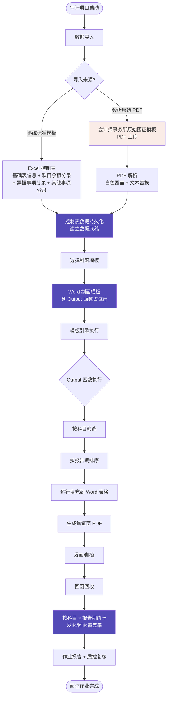

**关键节点说明**：

1. **数据导入**：支持两种来源——系统标准 Excel 模板（带科目维度）和会所原始 PDF（用于已用事务所模板的场景）。
2. **控制表**：导入后的数据落到系统控制表，是后续所有操作的"单一事实源"。
3. **模板选择**：用户为本次控制表选择一个 Word 模板（一个项目可配置多种模板，适配不同券商/银行格式要求）。
4. **Output 函数执行**：模板里的 `Output()` 函数被解析执行——按"科目"过滤数据，按"报告期"排序，逐行输出到表格。
5. **生成 PDF**：模板引擎把渲染好的 Word 转成询证函 PDF。
6. **作业统计**：发函/回函信息回填后，系统按"科目 × 报告期"交叉统计作业进度。

---

## 三、核心数据模型：Excel 控制表模板

### 3.1 模板结构

Excel 模板共 **4 个 Sheet**：

| Sheet | 用途 | 关键字段 |
|----|----|----|
| **基础表信息** | 控制表级元数据 | 函证编号、客户名称、被询证单位 |
| **科目余额分录** | 余额类询证数据（核心） | 科目（语义主维度）、截止日期/票据日期（报告期）、询证金额、事项、备注 |
| **票据事项分录** | 票据类询证数据 | 票据类型（应收/应付）、出票日期、票据编号、金额、受票人/出票人、备注 |
| **其他事项分录** | 自由文本说明 | 其他事项 |

### 3.2 「科目」字段——制函的语义主维度

`科目余额分录` Sheet 的 `REL:kmye_km`（科目）字段是制函逻辑的**核心**。当前系统支持的标准科目包括：

```
销售类: 主营业务收入
应收类: 应收账款、应收票据、预收账款
应付类: 应付账款、应付暂估、应付票据、预付账款
其他类: 其他应收款、其他应付款
```

**科目的作用**：

1. **制函渲染**：模板通过 `Output(科目余额分录.科目="主营业务收入")` 这样的过滤条件，把同一科目的数据集中输出。
2. **业务分组**：模板里 4 个业务板块（销售与未结算、采购与未结算、其他往来账项、其他事项）通过不同科目区分。
3. **统计管理**：发函/回函后，按"科目"统计覆盖率、回函率等。

### 3.3 「报告期」字段——按时间维度展开

`REL:endingDate`（截止日期/票据日期）字段控制数据的时间分布。当前模板的样本数据按年度组织：

- 2021 年度
- 2022 年度
- 2023 年度
- 2024 年 1-6 月

---

## 四、Word 制函模板的内部结构

### 4.1 模板整体框架

模板由 8 个 Word 表格 + 文本段落组成，结构如下：

| 段落/表格 | 作用 | 关键内容 |
|----|----|----|
| **抬头文本** | 函证基本信息 | `{{jcxx_UNIT_NAME}}`（被询证单位）、`{{CONFIRM_BASE_FIELD_CONFIRM_NUM}}`（函证编号） |
| **回函地址块** | 收件信息 | `{{CONFIRM_BASE_FIELD_RECEIVING_ADDRESS}}`、`{{CONFIRM_BASE_FIELD_RECEIVING_NAME}}`、`{{CONFIRM_BASE_FIELD_RECEIVING_PHONE}}` |
| **板块 1：销售与未结算** | 销售类科目汇总 | 应收账款表、应收票据表 |
| **板块 2：采购与未结算** | 采购类科目汇总 | 应付账款表、应付票据表 |
| **板块 3：其他往来账项** | 其他类科目汇总 | 其他应收/应付款表 |
| **板块 4：其他事项** | 自由文本 | 其他事项分录 |
| **盖章区** | 函证生效 | 公司盖章、日期、经办人 |
| **回函反馈区** | 客户回函标记 | "信息证明无误" / "信息不符"两栏 |

### 4.2 Output() 函数语法

模板的每个 Word 表格中嵌入 `Output()` 函数，从控制表取数。语法规则如下：

```
Output(
    字段路径 + 排序规则,
    过滤条件: 表名.字段 = "取值"
)
```

**典型实例**：

| 业务场景 | Output 函数 | 含义 |
|----|----|----|
| 销售板块——取主营业务收入按年度升序 | `Output（科目余额分录.截止日期/票据日期，asc，科目余额分录.科目="主营业务收入"）` | 过滤科目=主营业务收入的所有记录，按截止日期升序输出 |
| 销售板块——取应收账款按年度升序 | `Output（科目余额分录.截止日期/票据日期，asc，科目余额分录.科目="应收账款"）` | 过滤科目=应收账款的所有记录 |
| 应收票据 | `Output（票据事项分录.出票日期，asc，票据事项分录.票据类型="应收票据"）` | 从票据事项分录取应收票据 |
| 应付账款 | `Output（科目余额分录.截止日期/票据日期，asc，科目余额分录.科目="应付账款"）` | 过滤科目=应付账款 |
| 其他应收款 | `Output（科目余额分录.截止日期/票据日期，asc，科目余额分录.科目="其他应收款"）` | 过滤科目=其他应收款 |
| 其他事项 | `Output（其他事项分录.其他事项）` | 自由文本分录直接输出 |

### 4.3 模板可编辑性

**关键能力**：模板是 Word 格式，可在系统内嵌的 Word 编辑器中直接编辑。

- 用户可自由调整文本段落、表格样式、增加/删除业务板块
- 右侧"控制表函数"面板提供可用字段列表，支持插入
- 模板的修改实时保存，可在不同项目间复用

**截图：模板编辑器界面**

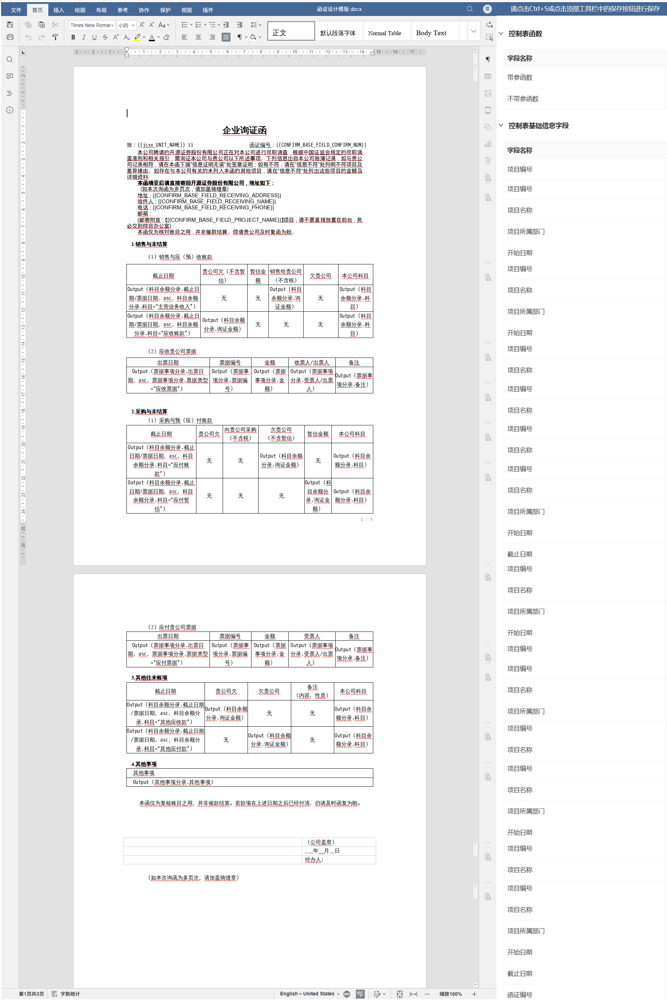

> 截图说明：左侧 Word 编辑区，函证模板含 4 个业务板块共 6 个数据表，每个表都有 Output() 函数占位符；右侧"控制表函数"面板列出所有可用字段。

---

## 五、制函后的实际效果（PDF 实例）

以"中信证券股份有限公司"为例，导入 401 条科目余额分录 + 161 条票据事项分录 + 25 条其他事项分录，生成 3 页 PDF：

### 5.1 销售与未结算板块输出

```
1.销售与未结算
（1）销售与应（预）收账款

截止日期      贵公司欠   暂估金额  销售给贵公司   欠贵公司   本公司科目
2021年度      无        无        5,000,000    无       主营业务收入
2022年度      无        无        5,000,001    无       主营业务收入
2023年度      无        无        5,000,002    无       主营业务收入
2024年1-6月   无        无        5,000,003    无       主营业务收入
2021年度      300,000   无        无           无       应收账款
2022年度      301,000   无        无           无       应收账款
2023年度      302,000   无        无           无       应收账款
2024年1-6月   303,000   无        无           无       应收账款
```

**特点**：
- 同一科目的多条记录按报告期（截止日期）**升序排列**
- "无"字填充表示该记录此字段为空（无值即空）
- 多个科目集中展示，便于被询证单位核对

### 5.2 票据板块输出

```
（2）应收贵公司票据
出票日期      票据编号   金额      收票人/出票人   备注
2021-12-31    1000005   5,004     西小点0005     备注5
2022-12-31    1000006   5,005     西小点0006     备注6
2023-12-31    1000007   5,006     西小点0007     备注7
2024-06-30    1000008   5,007     西小点0008     备注8
```

### 5.3 其他往来账项板块输出

```
3.其他往来账项
截止日期      贵公司欠   欠贵公司   备注     本公司科目
2021年度      603,001   无        无       其他应收款
2022年度      603,002   无        无       其他应收款
...
2021年度      无        603,005   无       其他应付款
2022年度      无        603,006   无       其他应付款
...
```

---

## 六、实际制函作业模式（用户视角的完整路径）

> 本节基于真实的「往来函证 0813」项目页面对当前制函模式进行端到端梳理，说明用户从进入系统到生成 PDF 的真实操作步骤、按钮位置、模板选择策略。

### 6.1 制函主页面布局

**截图：制函管理主页**

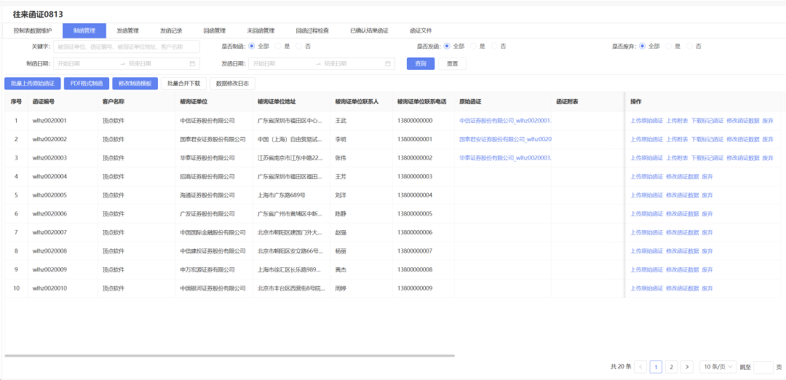

> 截图说明：项目「往来函证 0813」下的「制函管理」Tab 页。顶部为查询区（关键字、是否制函/发函/发函、日期范围），下方为 4 个动作按钮 + 数据列表。

**顶部动作按钮（共 5 个）**：

| 按钮 | 位置 | 作用 |
|----|----|----|
| **批量上传原始函证** | 按钮区第 1 个 | 把已用事务所模板的 PDF 一次性上传到本项目 |
| **PDF 格式制函** | 按钮区第 2 个 | 主流制函入口，从控制表数据生成 PDF 询证函 |
| **修改制函模板** | 按钮区第 3 个 | 进入 Word 模板编辑器，修改/调整模板格式（极少用） |
| **批量合并下载** | 按钮区第 4 个 | 把多份已制函 PDF 合并成一个文件下载 |
| **数据修改日志** | 按钮区第 5 个 | 查看函证数据被谁、什么时候修改过 |

**数据列表列含义**：

| 列 | 含义 |
|----|----|
| 函证编号 | 系统生成的唯一编号，如 `wlhz0020001` |
| 客户名称 | 当前控制表对应的客户（一般为本审计项目） |
| 被询证单位 | 函证发送的目标公司（银行/客户/供应商等） |
| 被询证单位地址、联系人、联系电话 | 收件信息 |
| 原始函证 | 关联的原始 PDF（如有） |
| 函证附表 | 详细分录附表 |
| 操作 | 单条记录的上传/上传附表/下载/标记函证/修改函证数据/废弃 |

### 6.2 标准制函流程（绝大多数场景）

**用户使用时的真实路径**：

```
进入「制函管理」Tab
   ↓
1. 点击【PDF 格式制函】  ← 最常用入口
   ↓
2. 弹出"批量制函"对话框，选择已配置好的【函证模板】（下拉）
   - 常用模板：往来函证模板（销售、采购）  ← 绝大多数项目选这个
   - 其他模板：非相邻函证 等（按需选择）
   ↓
3. 左侧列表勾选要制函的函证（多选）
   - 关键操作：用户可按函证编号、客户名称、被询证单位、联系人、联系电话、收件地址筛选
   - 右侧"已选项目"实时显示已勾选的函证
   ↓
4. 点击【确定】 → 系统开始批量生成 PDF
   - 后台按勾选顺序逐份执行 Word 模板引擎 → 转 PDF
   - 完成后停留在制函管理列表，可下载/批量合并下载
```

**截图：PDF 格式制函 - 选择模板**

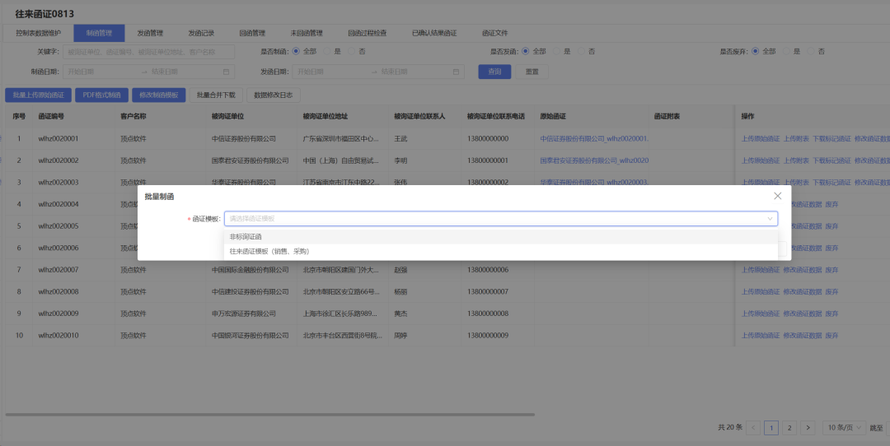

> 截图说明：点击【PDF 格式制函】后弹出"批量制函"对话框，"函证模板"下拉框中可选择已配置好的模板。系统默认提供"往来函证模板（销售、采购）"等常用模板。

**截图：批量制函 - 勾选函证**

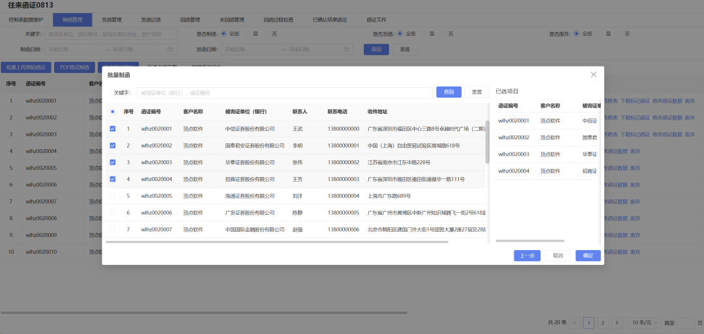

> 截图说明：选好模板后，弹出"批量制函"对话框，左侧是函证列表（支持搜索和分页），用户勾选要制函的函证。右侧"已选项目"实时显示已勾选条目。底部有"上一步/取消/确定"三按钮。

### 6.3 修改制函模板流程（少数场景）

**触发条件**：当制函后 PDF 格式不满足要求时（例如某个银行函面格式特殊、需要新增字段、报表格式调整等），才会进入此流程。

**用户使用时的真实路径**：

```
在「制函管理」Tab 页面
   ↓
1. 点击【修改制函模板】按钮  ← 较少使用
   ↓
2. 弹出"选择修改控制表"对话框，选择要修改哪个控制表对应的模板
   - 列表中显示系统中所有可编辑的控制表
   - 选择目标控制表后点击【确定】
   ↓
3. 进入 Word 模板编辑器（仅 OnlyOffice 内嵌）
   - 左侧：Word 文档编辑区
   - 右侧：「控制表函数」面板，列出可插入的字段（带参函数、不带参函数、基础表信息字段等）
   - 顶部工具栏：完整的 Word 操作（字体、段落、表格、插入图片等）
   ↓
4. 按业务需要调整模板：
   - 调整文本段落、标题样式
   - 调整表格列宽、行高
   - 在表头/表格中插入 Output() 函数或 {{变量}}
   - 顶部提示「请点击 Ctrl+S 站点顶部工具栏中的【保存】按钮进行保存」→ 切记主动保存
   ↓
5. 模板保存后，再回到 6.2 节的【PDF 格式制函】流程即可使用新模板
```

**截图：修改制函模板入口**

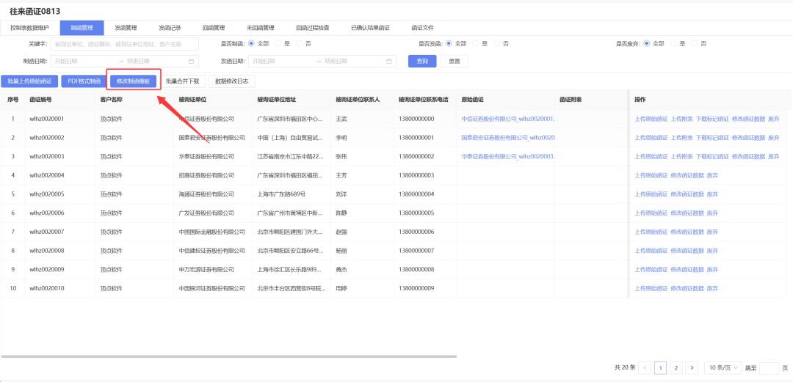

> 截图说明：在「制函管理」Tab 页面顶部动作按钮区，红框标注【修改制函模板】按钮，提示用户该入口位置。

**截图：选择修改控制表**

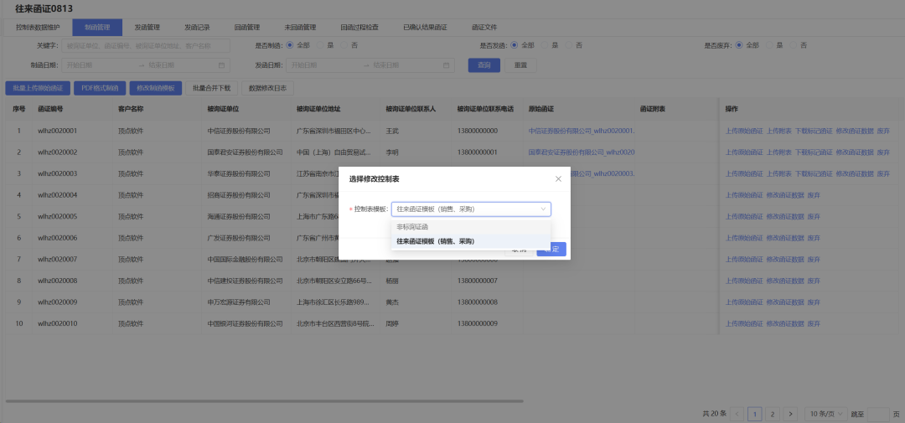

> 截图说明：点击【修改制函模板】后，弹出"选择修改控制表"对话框，列表显示系统已有的控制表（如"往来函证模板（销售、采购）"），用户选择目标后点击【确定】。

**截图：修改制函模板编辑器**

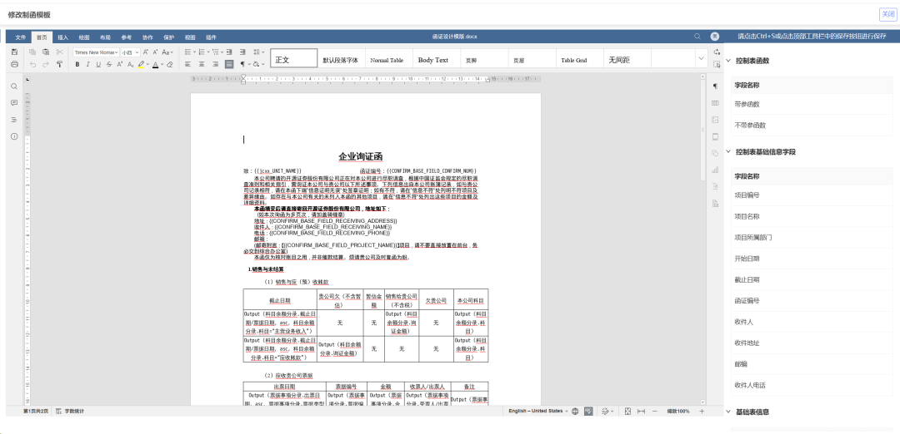

> 截图说明：进入 Word 模板编辑器（OnlyOffice 内嵌）。左侧为可编辑的 Word 文档（函证模板 + Output 函数占位符），右侧为"控制表函数"字段面板（带参函数、不带参函数、基础表信息字段），顶部为 Word 工具栏。右上角提示"请点击 Ctrl+S 站点顶部工具栏中的【保存】按钮进行保存"。

### 6.4 当前制函模式的整体流程图（用户视角）

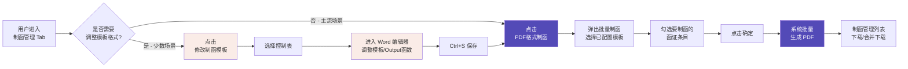

### 6.5 当前制函模式的关键设计特征

| 特征 | 当前实现 | 业务影响 |
|----|----|----|
| **制函模板多套并存** | 同一项目可配置多个 Word 模板（销售采购模板、非相邻函证模板等），用户制函时主动选择 | 灵活，但用户需先选模板再勾选，**多一步交互** |
| **模板与控制表绑定** | 每个控制表有默认模板，模板在"修改制函模板"里按控制表粒度编辑 | 模板复用范围 = 控制表粒度，跨项目复用受限 |
| **修改模板是"低频运维"** | 仅在格式不满足时使用，业务高峰期几乎不动 | 模板编辑器专业门槛高（需懂 Output 函数 + Word 排版） |
| **批量制函是"高频作业"** | 一次勾选多条函证批量生成 PDF | 主流场景效率高，但每次都要先选模板再勾选 |
| **模板与制函分离** | 修改模板是独立入口，不打断制函主流程 | 降低误操作风险，但也增加了"找入口"的认知成本 |
| **制函前无预览** | 选定模板、勾选函证、点确定后**直接生成 PDF**，中间无预览环节 | 效率高，但若模板配置错误，需下载 PDF 后才能发现 |
| **制函模板可在线编辑** | 通过 OnlyOffice 内嵌编辑器直接修改 docx | 模板迭代快，但依赖浏览器+OnlyOffice 性能 |

### 6.6 当前模式痛点初探（供后续讨论/优化）

> 以下痛点基于本节梳理，**仅作为优化讨论起点**，不构成产品决策。

1. **「模板选择」与「勾选函证」分两步走**：每次批量制函都要先选模板再勾选，如果项目默认模板不匹配，需要每次都改，**对模板固定的客户是冗余步骤**。
2. **「修改制函模板」入口较隐蔽**：在制函管理 Tab 的按钮区里，用户如果不是主动去找，可能不知道有"修改模板"能力。
3. **修改模板后无"已变更"提示**：保存后用户需要切回制函 Tab 再点【PDF 格式制函】才知道生效，**缺一个"模板已更新，可以基于新模板重制"的引导**。
4. **无"制函预览"环节**：选定模板后没有单条预览样张，用户只能点确定后看结果再决定是否返工。
5. **「批量合并下载」与「单条下载」混在同一列表操作区**：批量制函完成后，操作列里既有"下载函证"也有"批量合并下载"，**两条路径都生成 PDF，需要用户自行选择**。
6. **「函证附表」是独立概念**：操作列里"上传附表"和"函证附表"列的存在，说明函证附表是独立上传/生成的，**与主函面是两条产物线**，可能存在重复工作。

### 6.7 用户调研补充（2026-08-18）

> 本节记录用户在实际使用/调研中反馈的两个核心诉求，作为后续产品优化的直接输入。

#### 6.7.1 诉求一：模板调整交互过于复杂，需"去代码化"

**现状问题**：当前「修改制函模板」需要用户进入 OnlyOffice Word 编辑器，接触 `Output()` 函数、`{{变量}}` 等**类代码语法**。对没有经验的用户来说学习成本高、上手难。

**用户反馈原文要点**：

> 制函的模板调整这块太复杂了，还有各种代码和 output 函数。用户使用函证系统，一般希望一个没有经验的人也能快速上手，这种东西会增加用户的学习使用成本。能不能更换为更友好的交互方式？

**痛点本质**：模板调整目前是"代码式/函数式"的低频运维动作，把专业门槛（懂 Output 语法 + Word 排版）暴露给了普通用户。

**优化方向**：把"调整模板"从"改代码"变为"可视化配置"，让无经验用户也能完成，详见 6.7.3 节的方案构想。

#### 6.7.2 诉求二：科目数据映射方式不灵活，希望"表格即数据"直填

**现状问题**：当前是"数据导入（按科目）→ 模板 Output 函数过滤"的**结构化映射**，用户无法随心所欲地定义函面上某个表格长什么样（几列、表头是什么、放哪些数据）。

**用户提出的新方法（原文要点）**：

> 这种从导入数据到制函模板的科目数据映射方式还是不够灵活。用户提出一种方法：给定一个模板，用户自己在 Excel 表中维护好制函表格中的科目数据——**包括表格有几列、每一列的表头和内容是什么**，系统只需要帮用户把对应的表格放到模板指定的位置就行了。
>
> 这里，一个函证可能出现多个表格，那这个 Excel 中可能会有多个 sheet，**每个 sheet 放在模板的哪个位置，也要支持用户去定义**。

**诉求本质**：从"系统定义科目结构 + 模板按函数取数"转为"**用户完全掌控表格内容 + 系统只负责排版**"。即把"数据如何呈现"的决定权从系统模板交还给用户。

**两种模式对比**：

| 维度 | 现状（Output 函数映射） | 诉求（Excel 直填 + 模板占位） |
|----|----|----|
| 表格结构（几列/表头） | 模板里固定写死 | 用户在 Excel 里自由定义 |
| 数据内容 | 系统按科目从控制表取数 | 用户自己维护好，直接给出 |
| 放置位置 | Output 函数所在处 | 用户指定"哪个 sheet 放模板哪个位置" |
| 用户能力要求 | 需懂 Output 语法 | 只会在 Excel 填数据 + 拖拽定位 |
| 灵活度 | 受模板函数结构约束 | 任意表格结构、任意位置 |

#### 6.7.3 方案方向已确认（2026-08-18）

**关联**：诉求一（去代码化）与诉求二（表格即数据直填）方向一致——都是**降低用户上手门槛、把函面呈现的控制权交还用户**。

**已确认的 3 个关键决策**：

| 决策点 | 结论 |
|----|----|
| **表头来源** | **Excel 决定**：用户在 Excel 里自由定义列数/表头/数据，系统按 Excel 动态生成表头+数据，最灵活 |
| **位置映射方式** | **拖拽绑定**：在可视化模板编辑器里，把 Excel 的 Sheet 拖到模板某个表格位置 |
| **Output 函数去留** | **双模式并存**：新的 Excel 直填方案 + 现有 Output 函数/{{变量}}模式**都保留**，不彻底替代 |

> ⚠️ 第三点经用户二次确认修正：**不做"彻底切换"**。老用户已有的 Output 函数模板不能被废掉，需要兼容并存。

#### 6.7.4 双模式并存的设计构想（供讨论）

**核心问题**：既然两种模式并存，就要避免用户困惑"我该用哪种？"，需要明确边界和引导。

**并存的基本思路——按"模板能力"区分**：

| 维度 | 模式 A：Output 函数（现有） | 模式 B：Excel 直填（新增） |
|----|----|----|
| **适用人群** | 熟悉函数的老用户/复杂场景 | 无经验的新用户/常规场景 |
| **数据来源** | 系统控制表 + Output 取数 | 用户自己维护的 Excel |
| **表格结构** | 模板内固定列 | Excel 里自由定义列/表头 |
| **优势** | 数据与系统控制表联动、可跨函证复用 | 零学习成本、任意表格结构、所见即所得 |
| **劣势** | 门槛高、结构受限 | 数据需手动维护、与系统控制表解耦 |

**并存的 3 个关键设计考量**：

1. **一个模板里能否混用两种模式？**
   - 建议：**允许**。模板的某几个表格用 Output 取系统数据，另几个表格用 Excel 直填（如"其他事项"这类灵活内容用 Excel 更合适）。
   - 好处：把"系统擅长的结构化科目数据"和"用户擅长的自定义内容"各用所长。

2. **制函入口如何选择模式？**
   - 建议：**跟随模板决定**，不做全局模式开关。用户选哪个模板，就按那个模板的类型走；模板创建时可选"Output 模板"或"Excel 直填模板"。
   - 好处：用户不需要理解"模式"概念，只要会选模板。

3. **数据来源冲突如何处理？**
   - 若同一函证既走系统控制表（Output）又挂 Excel 直填数据，需要明确**Excel 直填的数据以何种方式挂到该函证**（上传一个 Excel 附件？还是维护在项目级配置里？）——这是下一步要细化的问题。

**细化决策已确认**（详见 6.7.6）：
- ✅ **存储挂载**：挂在函证级，每个函证各维护一份 Excel（含多个 Sheet）；
- ✅ **渲染规则**：表头样式跟随模板样式、表格宽度与函证模板文本宽度相同；
- ✅ **模板创建/复制**：可从现有模板复制，模板可维护一套含多个 Sheet；
- ✅ **Sheet 复用**：一个 Sheet 可放多个位置（保留灵活性，暂不做业务限制）。

#### 6.7.6 细化决策确认（2026-08-18）

**决策 1：渲染规则——样式与宽度跟模板**

> **结论**：Excel 直填渲染时，**表头样式与模板样式一致**（字体、字号、加粗、底色等），且**表格宽度与函证模板文本宽度相同**。
>
> 即：Excel 只提供"表头文本 + 列内容"，**排版样式统一由模板控制**，保证函面整体视觉统一、宽度不超出文本区。避免不同用户维护的 Excel 样式五花八门破坏函面规范。

**决策 2：模板可复制 + 多 Sheet 管理**

> **结论**：支持**从现有模板复制**新建模板；一个模板可**维护一套 Sheet 清单**（可含多个 Sheet），**不要求每个 Sheet 都有数据**。只要**有数据的 Sheet 拖入模板能正常制函**即可。

含义：
- 用户可先复制一个"常用函证模板"，改名为新模板，再调整其中部分 Sheet；
- 模板里维护的是"Sheet 结构/位置"的骨架，Sheet 是否填充数据由各函证决定；
- 制函时，系统只渲染"有数据且已拖入模板位置"的 Sheet，空 Sheet 跳过。

**决策 3：Sheet 可复用（一表多位置）**

> **结论**：**一个 Sheet 可以放在模板的多个位置**。业务上暂无法给出"只能一表一位"的准确答复，因此**先保留灵活性**。

含义：
- 同一个 Sheet 可拖拽绑定到模板的多个表格位置（如同一份"其他事项"表同时出现在函面两处）；
- 渲染时系统按绑定关系在多个位置重复渲染该 Sheet 数据；
- 后续若业务明确"一表一位"，可再收紧，当前不做限制。

#### 6.7.5 数据挂载决策：每个函证一个 Excel（已确认）

> **决策**：Excel 直填的数据挂在**函证（控制表）级**，即**一份 Excel = 一份函证的内容**，其中 Excel 内的多个 Sheet 对应该函证函面上的多个表格。

**由此确定的数据组织方式**：

| 层级 | 内容 |
|----|----|
| **项目** | 一个审计项目，下含多个函证 |
| **函证（控制表）** | 一份函证 = 一份 Excel 的内容载体，Excel 内含多个 Sheet |
| **Sheet** | 函面上的一张表格（列数、表头、数据全部由用户在该 Sheet 里定义） |
| **模板位置** | 通过拖拽绑定，把 Sheet 放置到 Word 模板的某个表格/区块位置 |

**对制函流程的影响（Excel 直填模式的路径）**：

```
进入「制函管理」Tab
   ↓
1. 某函证 → 上传/维护该函证对应的 Excel（含多个 Sheet）
   ↓
2. 每个函证可选绑定一个模板，并通过拖拽把 Sheet 绑定到模板各表格位置
   ↓
3. 点击【PDF 格式制函】→ 勾选函证 →【确定】
   ↓
4. 系统：取该函证的 Excel → 按绑定关系把每个 Sheet 套进模板对应位置 → 生成 PDF
```

**关键业务含义**：
- Excel 直填数据与**函证一一绑定**，天然适配"勾选多个函证批量制函"——每个函证用各自的 Excel 渲染；
- 位置绑定关系（Sheet→模板表格）是**模板级配置**，可在不同函证间复用（同一模板的函证共用同一套绑定）；
- 与 Output 模式并存：同一函证既可用系统控制表数据（Output），也可在其 Excel 中补充灵活表格（Excel 直填），由模板类型决定。

#### 6.7.7 模板预览引擎选型：Word(OnlyOffice) 还是 Markdown？（讨论中）

**问题提出（用户）**：

> 用户给的模板一般就是 Word 格式，我们现在对 Word 的在线编辑用的是 OnlyOffice 这个插件。但 Word 格式在制函上肯定没有 Markdown 格式友好和美观。怎么能让用户导入的 Word 格式模板**自然转换成 Markdown 格式**让用户预览呢？还是说，继续使用 OnlyOffice 作为模板预览插件？

**矛盾点**：Word 是用户输入的主流格式（也是模板的原始载体），但 OnlyOffice 的在线编辑体验不如 Markdown 美观友好。两种诉求冲突：**输入是 Word，展示想用 Markdown**。

**技术可行性调研**：

| 方案 | 说明 | 适合度 |
|----|----|----|
| **pandoc / pypandoc** | 成熟的 docx→md 转换器，命令行/Python 均可，转换质量高 | ⭐⭐⭐ 首选 |
| **docx2markdown（Python 库）** | 专为 docx↔md 双向转换设计，可嵌入后端 | ⭐⭐⭐ 后端方案 |
| **python-docx + pandoc 组合** | 先 python-docx 读结构，再 pandoc 转 md，可控性强 | ⭐⭐ 定制场景 |
| **Word→HTML→Markdown** | 经 HTML 中转，能保留更多样式，但转换链较长 | ⭐⭐ 保真需求 |
| **仅用 OnlyOffice 预览** | 不转 md，继续用 Word 插件预览 | ⭐ 维持现状 |

**两条路径的权衡**：

- **路径 A：Word→Markdown 转换预览**
  - 优点：Markdown 预览友好美观、体积小、便于做可视化拖拽绑定交互、利于结构化解析（表格/字段）；
  - 挑战：docx 到 md 的转换**会丢失部分精细格式**（复杂表格合并、精确排版、页眉页脚、样式细节），存在"转换失真"风险；
  - 适用：若模板结构相对规整（函证模板以表格+文本为主），转换损失可控。

- **路径 B：继续用 OnlyOffice**
  - 优点：所见即所得、零转换失真、保留 Word 全部格式能力；
  - 缺点：编辑体验不及 Markdown 美观、无法轻易实现"拖拽绑定 Sheet"这种轻量交互、重度依赖 OnlyOffice 插件。

**关键判断点（待讨论）**：
1. **模板是否需要"所见即所得"的精美排版？** 若函证模板以规整表格为主、无需复杂 Word 排版，则 Markdown 转换风险低，倾向路径 A；
2. **"拖拽绑定 Sheet"这个核心交互在哪端实现？** 若在 Markdown/结构化编辑器里做更顺滑，则倾向转 md；若只能在 OnlyOffice 里做，则保留 Word；
3. **转换失真是否可接受？** 需要评估 docx→md 对"函证模板"这类文档的实际还原度（可先拿现有「往来函证模板（销售、采购）.docx」实测）。

**✅ 最终决策（2026-08-18，二次确认）**：**彻底取消 Markdown 这条线，统一使用 OnlyOffice 处理模板的编辑、绑定、预览**。

> 即：拖拽绑定 Sheet 到「Word 模板的表格」上做；最终制函格式严格按原始 Word 模板；Markdown 不再作为任何环节的交互或预览层。

理由：
1. **用户能直观看到** Word 模板的真实表格位置，所见即所得；
2. **兼容原有 Output 函数/{{变量}}**——绑定直接在 Word 表格上进行，不与现有函数机制冲突；
3. **零转换失真**——最终制函本就用 Word 模板，绑定关系直接建立在 Word 真实表格位置上，不存在任何转换失真问题；
4. **架构最简洁**——统一 OnlyOffice 一个引擎，同时承担"编辑 + 绑定 + 预览"三职责，避免维护 Markdown 转换链（docx→md 对宽表/部分表格转换不理想，反而增加复杂度和风险）。

### 6.7.8 docx→Markdown 还原度实测（2026-08-18）

**实验对象**：`往来函证模板（销售、采购）.docx`
**实验工具**：`docx2markdown`（Python 库，v0.1.1，纯 Python 无外部依赖）
**实验文件**：`../code/conversion_test/template_from_docx2markdown.md`（由 `convert_test.py` 生成）
**Python 环境**：pytorch 环境已装 `docx2markdown` + `python-docx`。

#### 还原结果评估

| 还原项 | 结果 | 说明 |
|----|----|----|
| **段落文本** | ✅ 完整保留 | 标题、正文、抬头、回函地址等全部还原 |
| **表格数量** | ✅ 8 个全还原 | 与 python-docx 读取的 8 个表格一一对应 |
| **Output() 函数** | ✅ 完整保留 | 全部 `Output（...）` 函数文本原样保留（注意：**括号转为全角**） |
| **{{变量}}** | ✅ 6 处全保留 | `{{jcxx_UNIT_NAME}}` 等抬头/地址变量无损 |
| **表头文本** | ⚠️ 基本保留 | 但"表头内软换行"被拆成 md 里两行（如"向贵公司采购 /（不含税）"） |
| **加粗标记** | ⚠️ 有瑕疵 | 连续加粗被拆散，如 `**3.****其他往来账项**`、`**本函填妥后请直接寄回****开源****证券股份有限公司**` |
| **图片** | — 本模板无图片 | 若有，docx2markdown 会导出到同目录子文件夹 |
| **空白行** | ⚠️ 冗余较多 | 表格间大量空行，markdown 排版略松散 |

**实测结论**：
1. **内容/数据层还原度较高**：函证模板核心的"文本 + 表格 + Output 函数 + {{变量}}"基本无损还原。
2. **排版样式层有失真**：表头内换行被拆行、连续加粗标记拆分、冗余空行多。且用户进一步观察发现**宽表（列多的表）转换效果不佳**、个别表格在预览中看起来不完整/未转换出来。
3. **结论**：虽然本模板 8 个表格实际都转成了 md（`| ---` 分隔行共 8 个），但**宽表/复杂表格的 markdown 渲染效果不理想**，作为"最终制函格式依据"有失真风险。

**✅ 对选型的影响（结合 6.7.7 最终决策）**：
- **彻底取消 Markdown 这条线**，模板的编辑、绑定、预览**统一使用 OnlyOffice**；
- **制函格式**严格以**原始 Word 模板**为准，拖拽绑定在 **Word 模板的表格上**（OnlyOffice 内）完成；
- 本次实测的价值在于**用真实数据证明了 docx→md 转换（尤其宽表/复杂表格）不理想**，从而及时否决了"Markdown 当预览/绑定层"这条路，让方案收敛到更简洁、零失真的 OnlyOffice 单引擎方案。

---

## 七、模板字段的两套机制

### 6.1 基础信息字段：`{{...}}` 模板变量

控制表级字段，函证抬头和回函地址用，例如：

| 字段路径 | 含义 | 实例 |
|----|----|----|
| `{{jcxx_UNIT_NAME}}` | 被询证单位 | 中信证券股份有限公司 |
| `{{CONFIRM_BASE_FIELD_CONFIRM_NUM}}` | 函证编号 | wlhz0010001 |
| `{{CONFIRM_BASE_FIELD_RECEIVING_ADDRESS}}` | 回函地址 | 东莞证券股份有限公司总部位于... |
| `{{CONFIRM_BASE_FIELD_RECEIVING_NAME}}` | 收件人 | 东莞证券 |
| `{{CONFIRM_BASE_FIELD_RECEIVING_PHONE}}` | 收件人电话 | 13800010002 |
| `{{CONFIRM_BASE_FIELD_PROJECT_NAME}}` | 项目名称 | 东莞证券 |

### 6.2 数据明细字段：`Output(...)` 函数

控制表分录级字段，函证数据表用。详见 4.2 节。

---

## 八、函证作业统计——科目维度的价值

发函/回函完成后，系统按"科目 × 报告期"交叉统计作业进度，**这是西点产品的核心管理价值**。

**截图：函证作业统计**

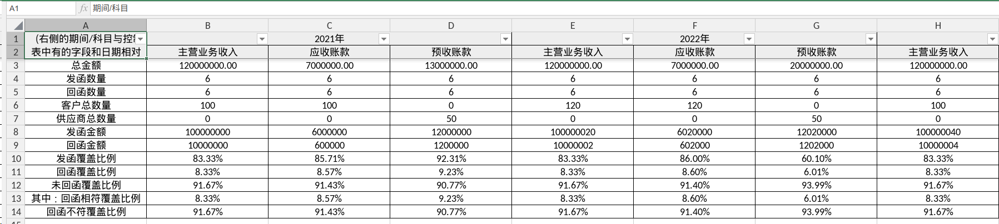

> 截图说明：横向 = 科目 × 报告期（主营业务收入2021年、应收账款2021年、预收账款2021年...）；纵向 = 13 项统计指标。

### 8.1 统计指标体系

| 类别 | 指标 |
|----|----|
| **金额类** | 总金额、发函金额、回函金额 |
| **数量类** | 发函数量、回函数量、客户总数量、供应商总数量 |
| **覆盖率类** | 发函覆盖比例、回函覆盖比例、未回函覆盖比例 |
| **回函相符类** | 回函相符覆盖比例、回函不符覆盖比例 |

### 8.2 统计样例（来自截图）

| 科目 \ 报告期 | 主营业务收入 2021 | 应收账款 2021 | 预收账款 2021 | 主营业务收入 2022 | 应收账款 2022 | 预收账款 2022 |
|----|----|----|----|----|----|----|
| 总金额 | 120,000,000 | 70,000,000 | 130,000,000 | 120,000,000 | 70,000,000 | 200,000,000 |
| 发函数量 | 6 | 6 | 6 | 6 | 6 | 6 |
| 回函数量 | 6 | 6 | 6 | 6 | 6 | 6 |
| 发函覆盖比例 | 83.33% | 85.71% | 92.31% | 83.33% | 86.00% | 60.10% |
| 回函覆盖比例 | 8.33% | 8.57% | 9.23% | 8.33% | 8.60% | 6.01% |
| 回函相符覆盖比例 | 8.33% | 8.57% | 9.23% | 8.33% | 8.60% | 6.01% |

**对作业管理的价值**：

1. **项目经理**：「应收账款 2022 年的回函覆盖比例只有 8.6%，需要催促」——按科目定位问题。
2. **质控复核**：「主营业务收入的发函覆盖比例是否达到审计准则要求」——按科目检查合规性。
3. **合伙人汇报**：「本项目函证覆盖比例 XX%，回函相符率 XX%」——按科目汇总管理。

---

## 九、与友商产品的关键差异（背景知识）

> 本节用于让 Agent 理解西点产品的设计取舍。

**友商产品**的导入数据是**平铺列结构**，无科目概念：

**截图：友商导入模板**

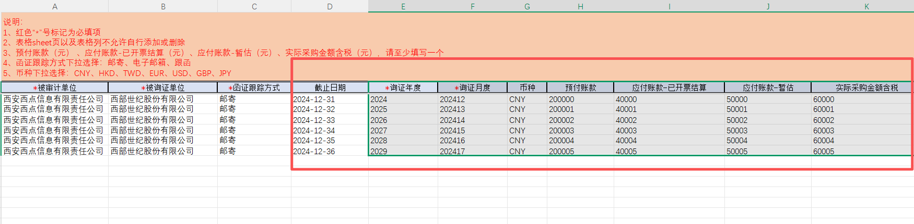

> 截图说明：横向直接平铺「预付账款、应付账款-已开票结算、应付账款-暂估、实际采购金额含税」等列，无科目维度。

**核心差异**：

| 维度 | 西点产品 | 友商产品 |
|----|----|----|
| 数据组织 | 按"科目"语义归集 | 按"列"平铺 |
| 模板可编辑 | ✅ Word 自由编辑 | ❌ 内置固定 |
| 多模板支持 | ✅ 同一数据可配多模板 | ❌ 一套函面 |
| 业务板块分组 | ✅ 销售/采购/其他/事项 4 板块 | ❌ 一次性平铺 |
| 按科目统计 | ✅ 13 项指标交叉分析 | ❌ 只能统计总发/回函数 |
| 逻辑判断 | ✅ Output 函数可过滤/排序/分支 | ❌ 简单映射 |

---

## 十、当前制函功能的关键设计决策

| 决策 | 当前实现 | 业务背景 |
|----|----|----|
| **数据带科目** | Excel 模板中"科目"字段为标准会计科目 | 审计作业按科目执行，函证是审计证据的采集手段 |
| **模板可编辑** | Word 模板，用户可自由调整 | 不同券商/银行函面格式差异大，需灵活适配 |
| **Output 函数语法** | 简化 SQL 风格，含过滤+排序 | 让产品经理/审计师可读懂、可修改 |
| **4 个业务板块** | 销售、采购、其他、事项 | 符合企业询证函的标准化结构 |
| **数据来源支持双通道** | Excel 导入 + 会所 PDF 上传 | 兼容两种作业习惯：系统制函 vs 会所原始函面 |
| **按科目统计** | 13 项指标交叉分析 | 项目经理/质控/合伙人多层级管理诉求 |

---

## 十一、Agent 优化时可参考的延伸点

> 以下是当前功能可改进的方向（仅作为 Agent 启动思路，不构成产品决策）：

1. **科目体系扩展**：当前标准科目有限，可考虑增加租赁负债、合同负债、长期待摊费用等新会计准则科目。
2. **Output 函数能力增强**：当前仅支持简单过滤+排序，可增加聚合（按科目汇总）、条件分支（IF）、跨表 JOIN 等。
3. **模板复用机制**：当前一个项目一个模板，可考虑模板市场、模板版本管理。
4. **智能识别科目**：用户上传 Excel 时，系统自动识别列名映射到标准科目，降低操作成本。
5. **多期对比**：在函面上直接展示同一科目 3-5 年的趋势，便于被询证单位核对。
6. **函证差异自动比对**：回函数据与发函数据自动比对，差异自动标红，生成"回函不符清单"。
7. **科目统计的细分维度**：除"科目 × 报告期"外，可加"科目 × 被询证单位类型""科目 × 函证类型"等。

---

## 十二、参考资料

| 文件 | 路径 |
|----|----|
| 数据导入 Excel 模板 | `E:/13_dingdian/02_产品/06_函证系统/01_售前演示数据/标准数据/导入数据/往来函证/往来函证模板-数据导入模版.xlsx` |
| Word 制函模板 | `E:/13_dingdian/02_产品/06_函证系统/01_售前演示数据/函证模板/往来函证模板（销售、采购）.docx` |
| 制函后 PDF 示例 | `E:/Downloads/中信证券股份有限公司 (1).pdf` |
| 模板编辑器截图（函证模板） | `../data/截图/screenshot_01_模板编辑器.png` |
| 函证作业统计截图（科目 × 报告期） | `../data/截图/screenshot_02_函证作业统计.png` |
| 友商导入模板截图（对比） | `../data/截图/screenshot_03_友商导入模板.png` |
| 制函管理主页截图 | `../data/截图/screenshot_04_制函管理列表.png` |
| PDF 格式制函 - 选择模板截图 | `../data/截图/screenshot_05_PDF格式制函模板选择.png` |
| 批量制函 - 勾选函证截图 | `../data/截图/screenshot_06_批量制函勾选函证.png` |
| 修改制函模板入口截图 | `../data/截图/screenshot_07_修改制函模板入口.png` |
| 选择修改控制表截图 | `../data/截图/screenshot_08_选择修改控制表.png` |
| 修改制函模板编辑器截图 | `../data/截图/screenshot_09_修改制函模板编辑器.png` |

---

## 十三、附：当前制函功能的一句话总结

> **西点函证系统的制函功能 = 带会计科目语义的 Excel 数据 + 可编辑 Word 模板（Output 函数引擎）+ 按科目 × 报告期多维统计的完整闭环**。区别于友商的"数据直通函面"模式，西点把"科目"作为核心语义维度，让制函不仅是文件生成工具，更是函证作业的管理系统。
